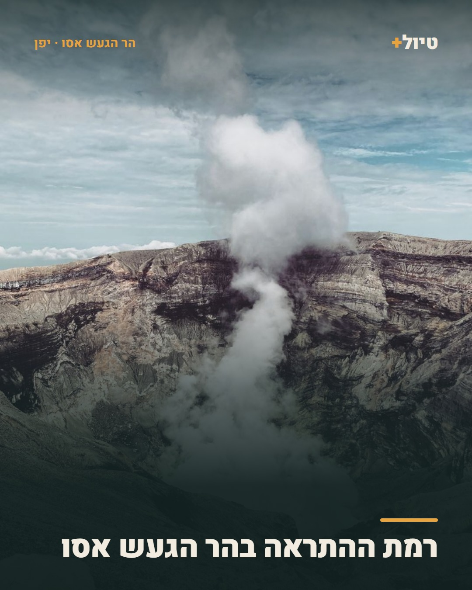
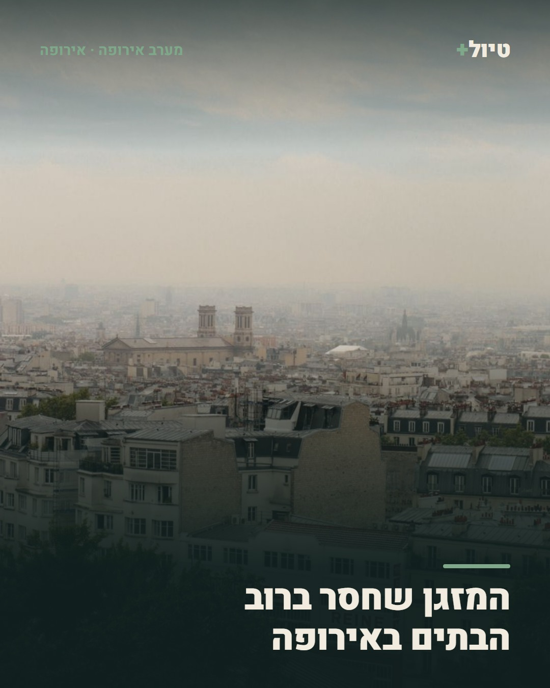
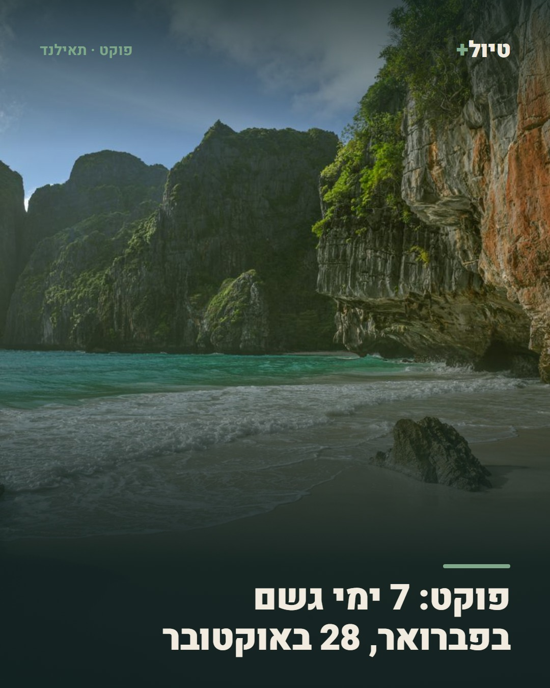

# tiyul+ · טיול+

A Hebrew travel-content pipeline for Israeli travellers. It reads primary
sources, drafts a post, renders a card, sends it to one person on Telegram for
approval, and publishes only when that person taps approve.

One destination per kind of post: a news **card** goes to Instagram, a
slideshow **deck** goes to TikTok. Telegram is where posts are approved, not
somewhere they publish.

Nothing publishes without a human tap. No claim is made without a source that
was fetched, right then, from a domain on an allowlist.

<p align="center">
  
  
  
</p>

<p align="center"><em>Real output. Left to right: a Smithsonian volcano report, a NASA
Earth Observatory piece, and ten years of ERA5 climate normals.</em></p>

---

## The loop

```
cards   sources → rank → draft (Claude) → verify → render → Telegram → ✅ → Instagram
                                  ↑                            ↓
                          reject with a reason            queue, drip out

decks   idea (Claude) → you tap בנה → places → facts → photographs → render ×2 → ✅ → TikTok + Instagram

clips   destinations → Pexels → vision judge → hook + beats → trim + burn in → ✅ → TikTok drafts

shoots  rotation → angle + destination → hook + beats + caption (Claude) → Telegram → YOU FILM IT
```

The fourth one is new and is not like the others: a **shoot** is a shot list,
and nothing publishes it because the video does not exist until somebody films
it. [`BRIEF.md`](BRIEF.md) is the editorial standard all four are now held to,
and the reason a fourth kind exists at all.

1. **Gather.** Twenty enabled feeds and one dataset, fetched live.
2. **Rank.** A cheap sort on titles and summaries, because the next step costs
   money. Authority, recency, specificity, topic balance.
3. **Draft.** One Claude call returns Hebrew copy, a layout choice, an image
   query, and a verbatim quote for every claim it makes.
4. **Verify.** The quotes must literally appear in the page that was fetched.
   No fares, no decimals on a card, no word used twice in a headline.
5. **Render.** Headless Chromium, because Hebrew needs real bidirectional text
   layout. 1080×1350 JPEG.
6. **Approve.** A Telegram DM with the card, the source URL, where the image
   came from, how many quotes were checked, and — when TikTok is a destination —
   the privacy level it would publish at, with a button to change it.
7. **Publish.** Instagram Graph API for cards; the TikTok Content Posting API
   for decks. One post drips out every four hours; a destination that fails is
   retried on its own, without re-posting to the one that worked.

## Three kinds of post

A **card** is one verified claim from one source, 1080×1350, and it goes to
Instagram. That is the loop above.

A **deck** is a slideshow — a cover and five to seven places — and it goes to
TikTok, and to Instagram as a carousel. It is built the other way round: Claude
proposes what would be worth watching, and only then does the pipeline go
looking for whether it can be sourced.

A deck is rendered **twice, in two design languages**. The TikTok set is
1080×1920 with no branding on it at all and the text placed wherever the
photograph is quietest — it is read over a video player's furniture, at arm's
length, for two seconds. The Instagram set is 1080×1350 drawn as a *card*: the
same wordmark, the same accent rule, the same type scale as the news cards, so a
slideshow in the grid looks like the account that posted it. Same words, same
photographs, two designs — one deck published twice, never two decks.

A **clip** is 15–35 seconds of vertical stock video carrying a Hebrew hook and
the two to five beats that deliver what the hook promised, and it goes to TikTok
only. There is no Instagram artefact for it the way a deck has a carousel, and
posting the same seconds to two places is how every account becomes a copy of
the others.

A **shoot** is a shot list. It is the one kind the bot does not make: it picks
the destination, the angle and the shape, writes the hook, the beats and the
caption, remembers which part of which series is next, and sends all of it to
Telegram for you to film. The two rules that matter most —
[`BRIEF.md`](BRIEF.md) rules 3 and 4, show the product and use real footage —
need a camera and a voice, and no pipeline has either.

**Three of the four arrive on a timer, and the difference between them is when
you get to say no.** A card and a deck are cheap to propose and expensive to
build, so you see them before they are made. A clip cannot be judged that way —
"a POV of a mountain pass with a line about flying to Italy" tells you nothing
about whether the footage is any good or whether the text landed somewhere
legible — so it is built and the finished video arrives with approve and reject
under it. A shoot has nothing to approve at all.

| | per day | arrives as | approve → |
|---|---|---|---|
| card | `DAILY_TARGET` (3) | the rendered card | Instagram |
| deck | `DECKS_PER_DAY` (2) | a line of text | TikTok + Instagram |
| clip | `CLIPS_PER_DAY` (3) | the finished video | TikTok drafts |
| shoot | `SHOOTS_PER_DAY` (1) | a shot list | nothing — you film it |

The shoot timer is the only one that is not governed by `RUN_HOUR`. A shot list
is acted on within the hour, so it arrives when the audience it is being filmed
for is on the app — 12:00–14:00 and 19:00–22:00 Israel time — and never between
Friday afternoon and Saturday evening. `src/schedule.js` answers both in
Israel's time zone rather than the VPS's. `/shoot` ignores all of it, because
asking is not the same as being offered.

Each is capped twice: a daily budget, and a ceiling on how many may be waiting
for a decision. A week away returns a handful to answer, not forty — an approval
queue you cannot face is a queue you stop reading. `/run`, `/deck` and `/clip`
ignore both, because asking is not the same as being offered.

**A slide carries a place name and nothing else, unless a number decides
something.** That is copied from the posts this channel is modelled on, and it
was arrived at the hard way: the first decks put a sentence under each name, and
a sentence on a slide reads as a guidebook no matter how it is set.

### Two styles, chosen per deck

The reference accounts use two different systems and averaging them produced
slides that belonged to neither. So a deck picks one, once, and every slide in
it matches:

| | **minimal** | **info** |
|---|---|---|
| looks like | a photograph you captioned | a card you would screenshot |
| type | Heebo 600, ~2.6% of the frame, **no outline** | Rubik 800, cream `#F7E3A1` over a bronze outline |
| colour | white or near-black, measured per photograph | always cream |
| carries | name, country, flag, at most one short note | name, flag, and the same fields in the same order |
| chosen when | most slides have fewer than one measured fact | most slides have one or more |

The type is deliberately **small**. A place name sits at about 2.6% of the frame
height, which feels wrong in a design tool and is right in a feed: it reads as
somebody captioning their own photograph rather than as a graphic laid over
stock. The minimal style carries **no outline at all** — a stroke around every
letter is not something TikTok's own text tool can produce, so the eye reads it
as foreign however good the rest of the slide is.

### Where the words go is measured, not guessed

`src/render/photo.js` draws each photograph to a 45×80 grid in the renderer's own
Chromium and reads the pixels back. For every candidate position it has the mean
luminance, the spread, and the texture — the mean step between neighbouring
cells, which is what tells a smooth gradient from a chequerboard. It returns the
centre of the quietest region as a fraction of the frame, the colour the type
has to be to survive there, and how hard the shadow has to work.

This replaced asking the vision model which third of the picture was "emptiest".
A model is the right tool for *is this actually the Eiger* and the wrong tool for
*what is the mean luminance of the region the text will occupy* — the second has
an exact answer, it is free, and it is the one that decides whether the slide is
legible. TikTok's button rail is excluded as a rectangle, which is why text on a
TikTok slide drifts left and on the Instagram render does not.

```
idea (Claude) → places (OpenStreetMap + Wikidata) → facts → photographs (curated by looking)
   → measure each photograph → render 1080×1920 and 1080×1350
   → Telegram album → you tap ✅ → TikTok + Instagram
```

**OpenStreetMap chooses the places; it never states a fact.** A place's tags
select it and rank it by how many language Wikipedias write about it, and then
every *sentence* on a slide is quoted from the official site of the place, of the
body that runs it, or of the body that contains it — checked
character-for-character, exactly like a card.

**The one documented exception is a structured measurement.** A summit has no
official website, no operator and no opening hours, so there is no page to quote
and summit decks came back as bare names — with the one fact anybody wants, the
height, sitting unread in Wikidata's P2044. `src/deck/facts.js` reads those
properties directly: an elevation, a length, a founding year. A property is not
prose. Nothing is written, the value is copied with its unit normalised, and the
QID travels with it. Prose about a place still needs its official page.

**Every name is Hebrew.** Wikidata has a Hebrew label for the famous places and
not for the rest, and the old code fell back to the English one — which is how
"Piz Bernina" and "Aletschhorn" shipped on a Hebrew slide. `src/deck/hebrew.js`
transliterates the rest and then *checks*: a name that still contains a Latin
letter is not used and the place is dropped.

`/deck` builds one from an idea of the model's choosing. `/deck Prague museum`
builds the one you asked for — and so does `/deck mountains Italy`,
`/deck japan autumn` or `/deck Santorini`, because the request is parsed when it
parses and interpreted when it does not. A thin result falls back to another
category or region rather than answering with a failure.

## What makes it different from "an AI wrote a post"

**A claim without a quote does not ship.** The drafting step returns
`evidence: [{ claim, quote }]`, and every `quote` is checked to appear
character-for-character in the text that was actually fetched. A model asked for
a quote will occasionally paraphrase one — and a paraphrased quote is precisely
the case where the claim came from the model's memory rather than the source.

**The rules are code, not prompt text.** A style rule that lives only in a
prompt holds until the model meets a source that pushes against it. The rounding
rule, the repeated-word check, the allowlist and the quote check are all
enforced after the model has spoken, and each returns a reason you can read in
Hebrew. (The **fare ban** used to be on that list and is now off by default —
see [`BRIEF.md`](BRIEF.md), "The fare ban is lifted". The detector is unchanged
and `FLIGHT_PRICE_GUARD=on` restores it; what it costs to have it off is stated
there rather than left to be discovered.) So is the shape of the copy: a headline outside 3-11 words,
a caption past four sentences, a filler adjective (מדהים, מרהיב, קסום...), or a
post that opens on a rhetorical question or "ידעתם ש" is sent back for another
draft rather than published. The brief also carries one real published post as
the standard every draft is measured against — headline that names and
withholds, subhead that answers, two-sentence caption, one emoji, two hashtags.

**Every filter is visible.** Rejections arrive as a digest with the reason and
the URL. A filter you cannot see is a filter you cannot disagree with.

## Sources

Primary sources only — the publisher of the fact, not someone reporting it.

| Source | What it gives |
|---|---|
| FCDO travel advice (`gov.uk`) | entry rules, safety changes, per country |
| UNESCO World Heritage Centre | new inscriptions, site decisions |
| NASA Earth Observatory | one specific place on Earth per day, from orbit |
| Smithsonian Global Volcanism Program | eruptions and unrest, weekly |
| JNTO (Japan) | Japanese-language travel news, plus the English Travel Japan blog |
| Kyoto City Tourism Association | festival seats, guided tours, tax rules — the things a visitor books |
| This is Athens (City of Athens) | closures, car-free days, what's new in the most-flown city |
| Tourism Authority of Thailand | the newsroom, with its trade half scored down |
| Vietnam National Authority of Tourism | islands, street food, heritage villages |
| My Helsinki, Sydney.com + Visit NSW (Destination NSW) | neighbourhood and day-trip guides with addresses; the Blue Mountains from Sydney |
| Visit Sevilla (Turismo de Sevilla) | a "¿Sabías que…" series — one odd fact per post about a street, a painting, a tower |
| Visit Sicily, Visit Lazio (regional governments) | the places the national portal never names: Ustica, the Nebrodi, a walk out of Frosinone |
| Visit Greenland, Tahiti Tourisme | slow feeds, long essays — when to go, a new marine reserve |
| Destination BC, Tourism Panama | seasonal long-form and trail-and-waterfall lists with named places |
| Open-Meteo ERA5 | ten years of daily values → monthly climate normals |

The official-DMO batch came from probing ~150 tourism-board and city-guide
domains for a feed our parser accepts, then reading what each one actually
publishes; a second pass over ~360 more (regions, provinces, states, parks,
museums, met offices) found that national boards almost never publish a feed
and regional ones often do. Twenty-two more are declared and switched off, each
with the probe result recorded in `sources.json` rather than quietly omitted —
the Cyprus feed is a restaurant directory, the Maldives one is resort marketing,
the US park feeds are mostly fatalities, Emilia-Romagna's item links all resolve
to its homepage, UNESCO's intangible-heritage feed is committee minutes except
for one week in December. `npm run check-sources` re-probes every enabled
one; `npm run eval-feed <url>` sizes up a candidate before it goes in.

The allowlist matches on a domain-label boundary, so `evil-gov.uk` and
`gov.uk.attacker.com` do not pass as `gov.uk`.

## Cards

Ten layouts in two families. Photo-led is the default — this is a travel
channel, and a wall of typography is what a spreadsheet looks like. Text-led is
for the cases with no single place to photograph: a rule spanning many
countries, a comparison, a figure with no address.

**The card carries the headline and nothing else.** The subhead is written, and
it opens the description instead. A card that answers its own headline gives
nobody a reason to tap "more".

Headlines name a subject rather than narrating it. `קרחון ענק צף במיצר` is a
complete sentence, so it answers itself; `הקרחון הענק בין גרינלנד לאיסלנד` is a
definite noun phrase that names a specific thing and withholds the story. The
verb is what gives it away.

Images are commercial-license stock, our own catalogue, or AI-generated — never
lifted from a news article or a business's page. Which one it was is printed in
the approval message. AI imagery may only ever be generic; a prompt naming the
post's own place is rejected in code.

A photo post should almost never fall back to a text card, so the picture is
looked for five times before giving up: the scene the draft asked for, a broader
second search it also supplies, the place by its English name, the country. Each
search ranks the library's thirty results by their own descriptions — a scene
beats a person posing in front of it, a product shot is refused outright — and
asks for a portrait first, anything second. The bytes come from the CDN as an
exact 1080×1350 crop rather than the 800×1200 thumbnail that was being upscaled
before. A `fact` card about somewhere with a name is promoted to `photoFull` in
code, because on a travel channel a dark card with a headline is a photograph
that was not asked for.

## Running it

Requires Node 18+ (developed on 24) and no build step.

```bash
npm install
npx playwright install --with-deps chromium
cp .env.example .env      # then fill it in
npm test                  # 744 offline checks, no credentials needed
npm run check-sources     # probe every feed
npm run eval-feed <url>   # size up a feed before adding it
npm run run-once          # a full pass, printed to the terminal, publishes nothing
npm start
```

Slides cannot be reviewed by reading the HTML — Hebrew shaping, bidi, where a
line breaks, whether white type survives on that particular sky, all of it
happens at render time. Two scripts exist to look at them:

```bash
npm run deck-lab                      # fixed content, cached photographs, no model calls
npm run deck-once -- "Dolomites trails" "Kyoto temples"
```

`deck-lab` is the fast one: hand-written fixtures against real photographs, so a
number in the stylesheet can be argued with in about fifteen seconds.
`deck-once` is the whole pipeline — request, places, facts, curation, render —
written to `out/decks/` instead of to Telegram, with a contact sheet showing
every slide in a row and the measurements that placed each block underneath it.
Neither writes to the store and neither publishes anything.

TikTok, if you want it, is connected once with `npm run tiktok-token` — it
prints an authorization URL, you paste back the address you land on, and the
token pair is stored. Nothing about it goes in `.env` except the client key,
secret and redirect URI, because the access token lasts a day and is refreshed
continuously.

You need a Telegram bot token, your own Telegram user id, an Anthropic API key,
a Pexels key for photos, and an Instagram Business account with the Graph API.
[`SETUP.md`](SETUP.md) walks through each one, including the parts of Meta's
dashboard that are genuinely confusing.

[`DEPLOY.md`](DEPLOY.md) covers the VPS: it has to run there, because Instagram
fetches the card image from a public URL rather than receiving bytes.

## How a deck actually gets made

Two approvals, because the expensive half sits between them.

```
idea (text)  →  ✅ בנה  →  source + draft + render  →  album + card  →  ✅ אשר
   ~1 call                  minutes, search budget                     publishes
```

The first card is the **proposal**: a title, the region, the category, and the
list of places it intends to carry. Nothing has been sourced or rendered yet, so
rejecting it costs one message rather than a full build. Three answers:

| | |
|---|---|
| `📸 אינסטגרם` | build it for Instagram |
| `🎵 טיקטוק (טיוטה)` | build it for TikTok |
| `📸🎵 שניהם` | both |
| `🤖 שנה בהוראה` | reply with what to change — "make it autumn", "Osaka instead", "six places" — and the idea is revised |
| `❌ דחה` | one message spent |

The place list on the proposal is the deck's **plan**, not a promise. The build
sources its own places from the site or the map and may not find every one; the
approval card after the build is the real list.

Only the size that will be posted is rendered. Choosing Instagram does not pay
for the TikTok crop of itself.

## Why TikTok posts are drafts

TikTok's photo API has no field for a sound. `auto_add_music` is a boolean — on,
and TikTok picks a track you never see; off, and the post is silent, which costs
reach. There is no `music_id`, and no endpoint exposes an account's saved
sounds, so "use one of my sounds" cannot be built at either end.

The same API has a second mode. `post_mode: MEDIA_UPLOAD` delivers the slides to
the account's TikTok **inbox** — not the Drafts folder on the profile, which is
the first place anyone looks and the one place it will not be — and the creator
finishes it in the app: sound, cover, caption, then post.

Three of TikTok's rules stop applying in that mode, and none of them by choice:

- **No privacy level.** The post is not made by the client, so there is nothing
  to resolve and `creator_info` is not even asked.
- **No audit restriction.** `unaudited_client_can_only_post_to_private_accounts`
  governs what an unaudited *client* may publish, and here it publishes nothing.
  A draft can become a public post while the app is still in review.
- **No daily cap.** The five-per-24h limit counts posts made through the API.

The cost is that it is not unattended: a deck waits in your inbox until you open
TikTok, and nothing in this process can tell whether you ever did. So the
notification says what happened per destination — `📤 פורסם לאינסטגרם` and
`📥 טיקטוק: נשלח לטיוטות — עוד לא באוויר` — because "posted" is the one wrong
thing to say about a post that still needs you.

**Scopes are per mode, not per media type.** `video.publish` is direct posting;
`video.upload` is the inbox. Asking for the wrong one fails at `init` with
`scope_not_authorized`, and a token cannot gain a scope by refreshing — only a
new authorization grants more. `/tiktok` prints what the connection actually
holds.

### Commands in the bot

`/run` gather now · `/run 7` gather more than the daily target, overriding the
quotas and reporting each one it stepped over · `/redo` forget what was seen and
re-run, for testing a change · `/status` · `/health` every destination
separately, with its last error · `/usage` tokens and cost · `/igquota` ·
`/tiktok` connection, tokens, granted scopes and available privacy levels ·
`/tiktok_connect` which scopes a working connection needs and how to get one ·
`/sources` every feed with its last success and error, `/sources off <id>` to
stand one down · `/mix` topic balance · `/why` last run's rejections ·
`/deck` build one now, `/deck Kyoto temple` name it · `/clip` build a clip now,
`/clip 3` build three · `/shoot` a shot list to film now, `/shoot 3` three of
them · `/pending` ·
`/queue` what is waiting, numbered, with destinations · `/next` publish the
next · `/post 3` publish that one, out of turn · `/held` `/retry` `/clear_held`

**The bot talks like a CLI.** A command prints what you asked for; the daemon
does not chatter. Messages that arrive unasked are one line — a gather is
`📥 איסוף: 253 → 12 נבדקו → 1 לאישור`, not twenty-one source bullets — and the
detail lives behind `/status`, `/health` and `/sources`, where you go looking
for it. Failures and things waiting on you are the exception, because they
change what you would do next.

**The owner is not rate-limited by any of this.** Every guard here — the topic
quotas, the dedupe window, the daily target, the drip interval — protects the
feed from the pipeline, not from the person who owns it, who can already publish
anything by hand. So an owner-triggered post steps over all of them. What it
does not do is step over them quietly: each bypass is recorded with the
measurement that would have blocked it, shown on the approval card before you
tap, and sent again before the post goes out. Two Dolomites decks back to back
is a decision the bot will carry out and name.

Platform limits are a different category and are never bypassed. TikTok allows
an unaudited client five posts a day; the sixth is held, not failed, and the
message says when the slot frees.

## Layout of the code

| Path | What it does |
|---|---|
| `bot.js` | Telegraf bot: owner lock, staging, approve/reject, timers |
| `src/pipeline.js` | the daily loop, with a ceiling on drafting calls |
| `src/draft.js` | the Claude call and the whole editorial brief |
| `src/verify.js` | **the gate** — allowlist, quotes, fares, rounding, repeats |
| `src/score.js` | ranking before anything expensive happens |
| `src/render/` | templates, theme, Chromium |
| `src/render/photo.js` | measures each photograph: where the words go, what colour they are |
| `src/render/deckTemplates.js` | the two TikTok slide styles, minimal and info |
| `src/render/deckInstagram.js` | the same deck drawn as cards, for the grid |
| `src/oauthServer.js` | the localhost endpoint that finishes a TikTok connect from the browser |
| `src/deck/facts.js` | structured measurements off Wikidata properties |
| `src/deck/hebrew.js` | every place name in Hebrew, and the check that it is |
| `src/deck/request.js` | turns anything typed after `/deck` into something buildable |
| `src/deck/flags.js` | countries in Hebrew, with their flag |
| `src/sources/` | feed adapters and the climate dataset |
| `src/publish/` | Instagram Graph API, TikTok Content Posting API, publish targets |
| `src/pillars.js` | the quotas: tag, pillar, source and **place** |
| `src/deck/region.js` | which country a deck is in, and the check that it says so |
| `src/images.js` | image provenance policy |
| `src/usage.js` | token accounting, exposed as `/usage` |
| `post-config.json` | the editorial dials: caption pool, hashtags, slide type, destination weights |
| `src/postConfig.js` | reads and checks the above; the only module that knows the path |
| `src/hashtags.js` | the five tags under a slideshow, one of them the deck's own country |
| `src/video/vision.js` | judges a clip's thumbnail: is this somewhere worth going |
| `src/video/hooks.js` | the Hebrew hook and its beats, by filling a configured format |
| `src/video/overlay.js` | ffmpeg, the beat timeline, and text rendered through Chromium for bidi |
| `src/schedule.js` | Israel's posting windows and Shabbat, in Israel's time zone |
| `src/shoot/rotation.js` | which shape is next, the product floor, which part of the series |
| `src/shoot/plan.js` | the shot list: hook, beats, caption, what to film |
| `src/shoot/message.js` | what a shoot looks like on a phone, standing up |
| `src/urlLike.js` | the link pattern, where three import chains can all reach it |
| `src/models.js` | which model does which job, and the effort-parameter guard |
| `scripts/clip-lab.js` | build a batch of clips to look at |
| `scripts/clip-redo.js` | re-render specific clips with footage and line pinned |
| `scripts/` | selftest, source probe, card-hosting check, one-off runs |

### What a slideshow says, and what it does not

Four things about a published deck are decisions rather than code, and they all
live in `post-config.json`:

- **The caption is one short line, a question, and — on half of posts — a
  pointer to the bio. It still carries no URL and no brand name.** It used to be
  `למתכנן טיולים חכם בביו שלנו` over `www.tiyulplus.com` on every post, and that
  was removed because an external domain in a TikTok description is a demotion
  and the string was never tappable anyway. That argument was about the
  **domain**, and it stands: `assertNoUrl` runs before anything can become a
  candidate, and a caption containing `http`, `www.`, `.com` or `.co.il` throws
  in the build instead of becoming something you can approve by tapping. What
  came back — see [`BRIEF.md`](BRIEF.md) rule 8 — is the pointer with no domain
  in it, `הלינק בביו`, at the end, on `caption.ctaShare` of posts. A CTA on
  every post is not soft; it is a signature. The question is the other half of
  the shape, and it is there because a caption that states and stops gives
  nobody anything to type.
- **Five hashtags, two broad and three niche.** There were none. The deck's own
  country — `#פורטוגל` — spends one of the niche slots rather than adding a
  sixth, so the count is the same whether or not the country resolved.
  `#fyp` and `#foryou` were dropped: five is already inside the brief's three
  to five, so the count did not have to move — what moved is that two of the
  five were English words on a Hebrew post, competing in a pool that is not a
  pool but the whole application.
- **The type on a slide is small, light, and pinned to the upper-left or
  lower-left third.** Roughly 3% of the frame's short edge, ~32px on 1080x1920,
  regular weight, 90% opacity, one soft shadow, two lines maximum, no box and no
  brand mark. The measurement in `render/photo.js` still runs and still decides
  *which* of the two bands this photograph can carry and what colour the words
  have to be — it just no longer gets to answer "the middle", which on a
  landscape is where the subject is.
- **Destinations are weighted** toward where this audience actually flies —
  Greece, Cyprus, Georgia, Italy, Thailand, Japan, Portugal, Spain, Vietnam,
  Czechia. An unlisted country is not banned, only unpromoted. Because the
  climate rotation caps a destination at one post a year, what the weighting
  really buys is order: the favoured places get posted early in the year and the
  cold and long-haul ones get whatever is left.

The news **card** path is deliberately untouched. A card never publishes to
TikTok, and its caption is read somewhere a URL is worth printing.

### Clips — a stock video with one Hebrew line on it

Three arrive a day by default (`CLIPS_PER_DAY`), built and sent as playable
videos with approve and reject under them; `/clip` builds one on demand and
`/clip 3` builds three. An approved clip goes to the account's **TikTok
drafts** rather than straight out: the API has no field for choosing a sound,
and sound is the one thing that cannot be changed after publishing.

For working on the format rather than posting: `npm run clip-lab -- 4` builds a
batch to look at, and `npm run clip-redo -- <pexelsId>="the line"` re-renders
specific ones with the footage and the words pinned — the only way to judge a
styling change without three variables moving at once. Add `place=Switzerland`
when the judge got the country wrong: it sets the country for the line, the pin
and the tag together, which is the only way they cannot end up disagreeing.

Three a day is measured rather than cautious: the 26 destination queries return
**1479 unique vertical clips** in the allowed duration range, so even assuming
only half clear the destination gate that is over eight months of unique
footage. The catalogue is not the constraint — how many you are willing to look
at is, which is what `CLIP_BACKLOG_MAX` is for.

**A video is used once.** Every Pexels id that has been made into a clip is
recorded in the store and never offered again, and it is recorded when the clip
is **built** rather than when it publishes — a clip sitting in the approval chat
has been seen, and one you rejected was seen and turned down. With months of
unique footage behind the queries, spending an id on a rejected clip costs
nothing next to being handed the same video twice; `store.forgetClip(id)` puts
one back, and `clip-redo` re-renders by id and ignores the ledger entirely.

This is the fix for a real repeat, and the cause is worth recording. `/clip`
already built an "already used" set and passed it to the search, and the search
already filtered against it — but the set was mapped off `p.pexelsId` on rows
that had never stored one, so it was empty on every run since the feature
shipped. The filter looked right, ran every time, and did nothing.

**What the ledger cannot know is what it never built.** It is fed by the
pipeline, so it has a birthday, and everything this account posted before that
day left no record of which Pexels video it was — the published log did not
carry the field, and it prunes at 30 days regardless. Anything uploaded by hand
is invisible to it for the same reason. So a repeat of *older* footage is not a
filter that failed; it is a question nothing in the store can answer.

The remedy is `clips.search.denyIds` in `post-config.json`, which is checked
before anything is built and outranks every score. The Pexels id is printed
plainly on the approval card so there is something to paste. It is a file edit
on the server rather than a tap in the chat, which is the deliberate trade: the
deny list is small, permanent and reviewable, and footage you have already
posted is exactly the kind of decision that should be written down.

**The approval card shows what the judge thought.** `יעד n/10` is the gate,
`דירוג` is the rank it was chosen by, and `רחפן`, `גוף ראשון` and `עירוני` are
the flags that moved it. This was missing and it cost a batch: a drone shot went
out and the card gave no way to tell whether the judge had seen an aerial and
the penalty was too small, or whether it had misread the frame. Two faults, two
different fixes, and no way to tell them apart from the message.

**Clips need ffmpeg.** `sudo apt install -y ffmpeg` on the VPS. The bot checks
at boot and warns once rather than failing at the first clip of the day; cards
and decks are unaffected. The text is composited as an image rather than drawn
by ffmpeg, because `drawtext` has no bidi support and renders Hebrew reversed.

**The description is a pin, a question, sometimes the bio pointer, and five
tags.**

```
📍 צ׳ינקווה טורי, איטליה

לאן אתם טסים הבא?

תכננו טיול כזה בחינם — הלינק בביו

#פוריו #ויראלי #איטליה #טיולים #טיפיםלטיול
```

The hook is not repeated there — it is burned into the video, and printing it
again spends the description on something the viewer read two seconds ago. The
pin is first because it is the one thing the video cannot say and the one thing
somebody searching will match on. The question sits above the CTA so a viewer
who reads to the end hits the thing that costs them nothing before the thing
that asks them to leave.

**Every word of it is Hebrew, including the awkward names.** The site used to
stay in Latin, on the argument that "Cinque Torri" is a proper noun and what a
viewer would type into a search box. True, and beside the point: one Latin word
in the middle of a Hebrew line reads as a machine filling in a field. The vision
judge now returns a Hebrew spelling alongside the name it identified — the same
call, no extra cost — and `clips.sites` in `post-config.json` pins the spelling
by hand for the places this feed keeps returning to, because a transliteration
is a judgement call and the same valley spelled two ways across two posts is
worse than either spelling used consistently. A site with no Hebrew spelling
available is **dropped**, leaving the pin naming the country alone; it is never
printed in Latin as a fallback. Same rule as `src/deck/hebrew.js`, same check.

Both names are dropped unless the vision judge cleared `placeMinConfidence`, and
a site is dropped when the country was not established — naming the country is
strictly easier than naming a landmark inside it, so a confident site under an
unknown country is the judge contradicting itself.

**One country per clip.** The line burned into the video, the pin underneath it
and the destination hashtag are three statements of one fact, reached by three
different routes: the writer is told the country, the pin and the tag read it
off the judge. Nothing checked that they agreed, so a writer that ignored the
country it was given produced a post contradicted by its own description — and
no viewer needs to know which half is right to see it. A line naming any country
other than the clip's is now rejected before the encode, and the check knows
that שווייץ and שוויץ are the same country, because a guard that rejects the
owner's own spelling is a broken guard.

Everything below was settled by looking at rendered batches, and every one of
them is a value in `post-config.json` with a test in the selftest. They are not
meant to be re-argued per video.

**The clip is chosen by looking at it, not by reading its title.** Searching for
a camera technique — `pov walking mountain` — returns handlebars on a road that
is nowhere; measured, every clip those queries returned scored 0-4 out of 10 on
"would a viewer want to travel here". Searching the weighted destinations
instead returns Gullfoss, Tre Cime, Oia. `src/video/vision.js` then judges the
thumbnail, and `destination >= 7` is a **gate**, not a score term: a beautifully
shot POV of nowhere is still nowhere, and folding it into a weighted sum would
let the POV bonus buy a road back in.

**A drone shot is priced out, not banned.** BRIEF.md files "another stock
landscape" under Never and an aerial is the purest form of it, but a drone of
Lauterbrunnen is still somewhere worth going — so `rejectAerialOnly` stays off
and `aerialPenalty` does the work. At 4 the arithmetic is the rule: the gate is
7 and the scale ends at 10, so the best imaginable aerial ranks 6 and loses to
the weakest clip that cleared the gate on the ground. It is built only on a day
the ground returned nothing at all, which is the one case where it beats no clip
at all. It used to cost 1, which a destination score of 9 pays without noticing,
and that is how an aerial reached the approval chat.

**The line fills a known format, and the format is now a promise.** It used to
be a meme template — "top 5 X oat", "Average X in Y" — on the reasoning that
free composition returns clever originals with metaphors and clever is the wrong
*type*. That reasoning is still right and the target was wrong: those references
belong to accounts selling nothing, in English, and applied here they produced
seven videos decaying 672 → 33 views. A meme template over stock scenery
promises the viewer nothing, so nobody watches to the end, so the next video
starts lower.

The six formats in `clips.hooks.formats` are the brief's five shapes — mistakes,
a warning, a budget, a list, a myth — and what survives from the old file is the
rule that was never about memes: **fill a format, do not compose freely.**

**And the hook now has beats under it.** "3 טעויות שישראלים עושים בגאורגיה" over
eight seconds of scenery is a promise the video does not keep, and a broken
promise costs more than a dull one — the viewer who stayed for the answer and
did not get it is the one who scrolls past the next post. So the writer returns
the hook *and* the two to five lines that deliver it, `overlay.js` burns each
over its own window, and `beatCountMismatch` refuses a hook promising three
things that arrives with two. The source is looped to fill the length, which is
what lets a 26-second clip be built from the 5–30 second videos Pexels actually
holds.

**The type is 52px, `#FFF4B3`, no stroke, two rows, and it moves.** The block is
narrow (46% of the frame) *so that it wraps* — at 72% no position on a picture
with a central subject fits on clean sky, so the search settles for a straddle
and the line runs from sky onto rock. Two short rows on clean background beat
one long row across the subject. Three columns are offered and the measurement
picks whichever corner of the sky is actually empty.

**Guards are per format, not blanket.** Three separate guards — a first/second
person ban, a five-word floor, and a no-country rule — each silently rejected
lines the owner had approved by hand, every time looking like the writer had
failed. A guard that rejects a canonical line is a broken guard, and the
selftest asserts every approved line survives every check.

## Honest caveats

**The evidence check proves sourcing, not truth.** It proves a claim appears in
a page fetched from an allowlisted authority. If FCDO is wrong, this will
faithfully repeat FCDO being wrong. "Verified" here means *traceable*.

**The quote check is strict and will produce false rejections.** A model that
summarises two sentences into one loses the whole draft. Better to re-run than
to loosen it: a fuzzy quote match is indistinguishable from no check at all.

**Twenty-one of fifty-four declared sources work.** The rest are off with the
probe result recorded. A further eleven were probed on 2026-09-20 — Smartraveller,
USGS, the NHC, WHO, the Met Office, Canada, NPS, TfL, Go Tokyo, Visit Malta and
Turismo Roma — and not one cleared the bar: two 404s, three empty shells, one
feed abandoned in 2019, one stale since February, one timeout, and USGS, whose
109 fresh items all link to a JavaScript application that serves 155 characters
of "supported browsers" to a fetcher. `npm run find-feeds <site>` was written
during that pass and reads a site's declared `<link rel="alternate">` instead of
guessing paths; it is the reason the Malta and Roma feeds were found at all,
both of which then turned out to be empty. The two most wanted are `gov.il` and the Israel Airports
Authority, both behind Imperva. There is now a real browser fetch
(`src/browserFetch.js`), written to get past UNESCO's 403 — whether it is enough
for Imperva, which is a considerably more determined wall, is untested. Most
official tourism boards (Spain, Portugal, Greece, Dubai, Georgia, the Nordics)
publish no feed at all; those would need a page scraper, not a URL.

**The DMO sources are promotional by nature.** A city guide's feed is its events
calendar and its own campaigns. The scorer nudges performers and trade items
down and the drafting step declines what is not a trip, but the drafting step
costs money and the nudges are tuned on one week of items — `/usage` reports
how much drafting was thrown away, and that number is the one to watch.

**Counting feed items is not the same question as "does this source work".**
UNESCO served ten items a run and showed a green tick in `check-sources` for a
month while every article page behind those items returned 403 — the source was
contributing nothing and the probe said it was fine. `check-sources` now takes a
sample of items all the way through `verifySource()`, which is the actual gate.
The general lesson is that a health check measuring the cheap half of a pipeline
reports on the half that was never going to break.

**TikTok publishes privately until the app passes review.** An unaudited
Content Posting API client is offered `SELF_ONLY` and nothing else, so posts go
out visible to the account itself. That is not a bug to work around — it is what
the approval card shows you, what `/tiktok` reports, and what the review
recording is supposed to demonstrate. The privacy button grows more options the
moment TikTok grants them.

**The TikTok card is one image, not a carousel.** Photo posts accept up to 35,
the pipeline renders one, and one is what is sent. Nothing in the publisher
would object to more — but there is no second slide to send, so the post is a
single-image photo post.

**Some content thresholds are tuned on small samples.** The thin-source floors
were measured against one day of items. They are env-overridable and every
rejection reports the count it measured against the floor it used, so if they
start eating good sources the digest says so in numbers.

**Four quotas, and the fourth is geographic.** No single tag, pillar, source or
**place** may take more than its share of a rolling window of what actually
published. The place cap exists because the other three measure what a post is
*filed as* — and a feed can satisfy every one of them while being entirely about
one city, which is what happened: slideshows file as pillar `day` with no
source, so only the pillar cap could bite a run of Kyoto, and it did not.

**A deck must be where it says it is.** The cover's country comes from each
slide's own Wikidata claim; `where` comes from the string the map was searched
with. They are compared on ISO codes, and a mismatch refuses the build rather
than correcting itself — a deck headed "United States" carrying six Swiss peaks
looks right to a reader and files Switzerland under America in the quota that
exists to stop exactly that.

**Topic quotas only bind once there is a sample.** Below `QUOTA_MIN_SAMPLE`
published posts the shares are noise and nothing is capped.

**The publish retry rule is about double-posting, not importance.** If nothing
published, the item goes back on the queue, up to three attempts, then it is
dropped loudly. If *something* published, it is not retried, because retrying
would duplicate whichever destination succeeded.

## Three things that were only findable by running it

**`document.fonts.check()` does not check what it sounds like it checks.** The
guard against Hebrew rendering as tofu boxes was `document.fonts.check('900
100px Heebo')`, which reads exactly like "is Heebo available". It returns true
whenever the text can be rendered by *anything*, fallback included — on a page
with no `@font-face` rule at all it still returns `true`. The guard written to
catch a silent failure was itself silently passing. It now checks that a
`FontFace` for Heebo exists with `status === 'loaded'` **and** that Hebrew set in
Heebo measures differently from Hebrew set in a family that cannot exist.

**Cookie banners are an evidence-integrity problem, not a tidiness one.** A
gov.uk page's extracted text opened with ~500 characters of consent boilerplate.
The obvious cost is wasted prompt. The real cost is that a quote lifted from a
cookie notice would have passed verification and published.

**A word count silently disabled a quarter of the source registry.** The
evidence check required four words, splitting on spaces. Japanese does not put
spaces between words, so every Japanese quote counted as one word and was
rejected as "too short to be evidence" — meaning JNTO could never produce a
candidate, and the rejection blamed the drafting step for something it had done
correctly. No fixture would have caught it, because the fixture would have been
in English.

## Security

- Every credential lives in `.env`, which is gitignored along with every
  `.env.*` variant. Nothing else reads one.
- `data/` is gitignored, so cloning this does not leak what has been posted.
- The bot checks `ctx.from.id` against `OWNER_ID` in middleware registered
  before every other handler, and refuses to start without it. A missing config
  value fails closed rather than opening the bot to whoever finds the username.
- The bot also refuses to start with no publish destination configured — an
  approval queue with nowhere to publish silently eats what you approve.
- Fetched page content is only ever regex-matched and shown to the model. It is
  never evaluated in this process and never shelled out to. The one place HTML
  *is* rendered is our own templates, where every interpolated value goes
  through `escapeHtml()`.
- **The one exception, stated plainly:** a source that answers a plain fetch
  with 403 is retried through headless Chromium (`src/browserFetch.js`), and
  there the page really is rendered and its scripts really do run. They run in
  Chromium's sandbox, in a throwaway context with no storage and no
  credentials, with images, media and fonts blocked; what comes back out is
  HTML that goes through the same `htmlToText()` path as every other page. Only
  403 is retried — a 404 is a dead link and a 429 is a rate limit, and neither
  is fixed by asking again.
- Telegram messages are sent without `parse_mode`. A scraped title containing a
  stray `*` would otherwise break Markdown parsing and drop the message — which,
  for an approval card, means silently not asking.

## Licence

Not currently licensed for reuse. The bundled Heebo font is under the SIL Open
Font License; photographs come from Pexels under its own licence.
