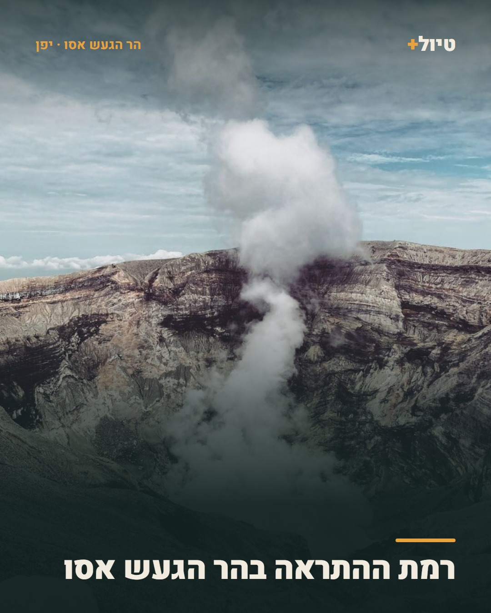
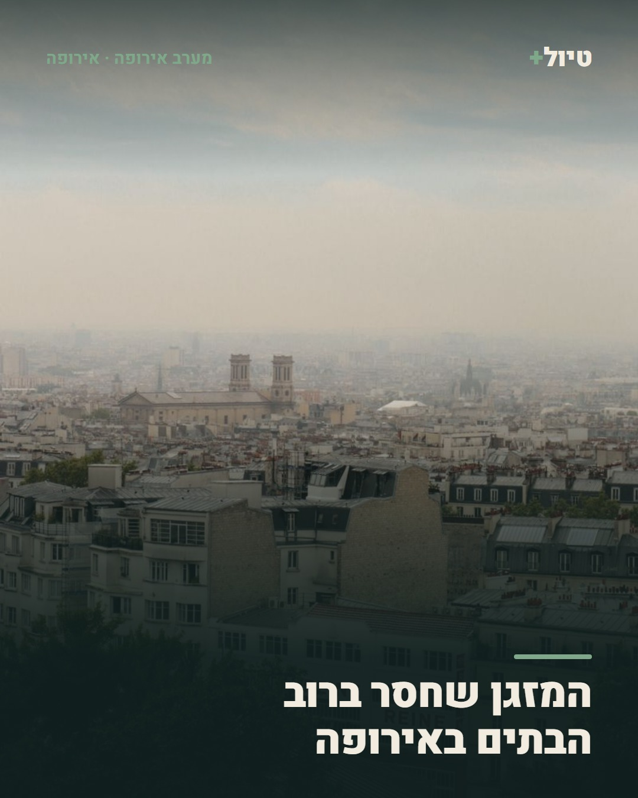
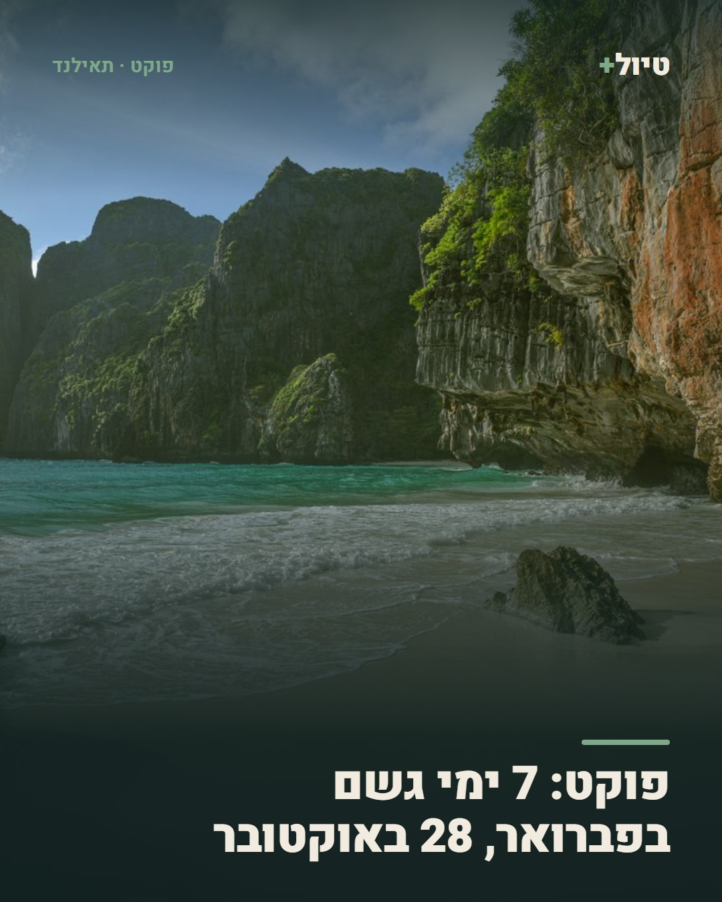

# tiyul+ · טיול+

A Hebrew travel-content pipeline for Israeli travellers. It reads primary
sources, drafts a post, renders a card, sends it to one person on Telegram for
approval, and publishes only when that person taps approve.

One destination per kind of post: a news **card** goes to Instagram, a
slideshow **deck** goes to TikTok. Telegram is where posts are approved, not
somewhere they publish.

Nothing publishes without a human tap. No claim is made without a source that
was fetched, right then, from a domain on an allowlist.

<p align="center">
  
  
  
</p>

<p align="center"><em>Real output. Left to right: a Smithsonian volcano report, a NASA
Earth Observatory piece, and ten years of ERA5 climate normals.</em></p>

---

## The loop

```
cards   sources → rank → draft (Claude) → verify → render → Telegram → ✅ → Instagram
                                  ↑                            ↓
                          reject with a reason            queue, drip out

decks   idea (Claude) → you tap בנה → places → facts → photographs → render ×2 → ✅ → TikTok + Instagram

clips   destinations → Pexels → vision judge → one line → trim + burn in → ✅ → TikTok drafts

shoots  rotation → angle + destination → hook + beats + caption (Claude) → Telegram → YOU FILM IT

plans   destination → itinerary (the site, or Claude) → render ×2 → ✅ → TikTok drafts + Instagram
```

Two of these are not like the other three. A **shoot** is a shot list, and
nothing publishes it because the video does not exist until somebody films it. A
**plan** publishes, but only when asked: it is the one post that promises a
stranger something. [`BRIEF.md`](BRIEF.md) is the editorial standard all five
are held to, and the reason the last two exist at all.

1. **Gather.** Twenty enabled feeds and one dataset, fetched live.
2. **Rank.** A cheap sort on titles and summaries, because the next step costs
   money. Authority, recency, specificity, topic balance.
3. **Draft.** One Claude call returns Hebrew copy, a layout choice, an image
   query, and a verbatim quote for every claim it makes.
4. **Verify.** The quotes must literally appear in the page that was fetched.
   No fares, no decimals on a card, no word used twice in a headline.
5. **Render.** Headless Chromium, because Hebrew needs real bidirectional text
   layout. 1080×1350 JPEG.
6. **Approve.** A Telegram DM with the card, the source URL, where the image
   came from, how many quotes were checked, and, when TikTok is a destination, the privacy level it would publish at, with a button to change it.
7. **Publish.** Instagram Graph API for cards; the TikTok Content Posting API
   for decks. One post drips out every four hours; a destination that fails is
   retried on its own, without re-posting to the one that worked.

## What the account posts, and the evidence for it

Six TikTok itinerary slideshows that worked were studied on 28 Sep 2026, against
two flops on the same topics and against this account's own posts. Counts are as
TikTok showed them; "saves" is TikTok's favourite count.

| Post | Followers | Likes | Saves/likes | Shares/likes | Slides |
|---|---:|---:|---:|---:|---:|
| @teonakan, 20 things to do in Prague | 2,200 | 108.3K | 0.58 | 0.21 | 21 |
| @juliatraveltips, Rome 3 day itinerary | - | 99.1K | 0.83 | 0.26 | 9 |
| @liri.turgeman, המלצות לפראג אהובתי | 956 | 21.5K | 0.66 | 0.37 | 12+ |
| @shiraztravel, תפסיקו לטוס רק לרודוס | 2,950 | 10.5K | 0.47 | 0.31 | 6 |
| @travel.with.dorina, מסלול לחודש בתאילנד | 1,196 | 9.6K | 0.95 | 0.52 | 24 |
| @dolci_tours, 10 ימים באיטליה | - | 2,203 | 0.54 | 0.19 | - |
| **flop** - a designed poster of generic facts | - | **9** | - | - | 1 |
| **flop** - one template, posted by three accounts | - | **2-4** | - | - | - |
| **ours** - the Italian lakes deck | 1 | **9** | 0.22 | **0.00** | 6 |

Every account in the top half has between 956 and 2,950 followers, which matters:
TikTok says follower count and past performance are not direct ranking factors and
that finishing and time spent weigh more. The bottom half is the other lesson -
the For You feed deprioritises "reproduced or unoriginal content without any new or
creative edits", and one template posted by three accounts is exactly that.

**Seven mechanisms**, in the order they cost this account the most:

1. **It is a tool, not a mood.** Saves run at 47 to 95% of likes on every winner.
   People bookmark a plan for a trip they are actually planning. Ours were moods -
   "places that look painted" - nice once, nothing to come back to.
2. **It settles a group-chat decision, so it gets forwarded.** Shares run at 19 to
   52%. Trips are planned with other people, and a post that answers "where, and
   for how many nights" gets sent to the partner.
3. **It holds attention slide by slide.** The winners are 9 to 24 slides and
   structured so the viewer always knows where they are. Ours showed one name per
   slide and could be skipped in half a second.
4. **Proof that somebody chose.** Phone photographs, people in frame, and behind
   them a human making trade-offs. Generic stock plus no opinions reads as an
   aggregator.
5. **It speaks the platform's native language.** TikTok's own text styles, emoji
   rows, spoken Hebrew. Designed posters read as advertisements and get skipped.
6. **The hook names a decision or voices a doubt.** "מה עושים 5 ימים בפראג? לא
   משעמם שם?" beats "האגמים הכי יפים באיטליה".
7. **It ends by giving, not asking.** We closed with "רוצים עוד? תעקבו", an ask
   that offers nothing, and got one follower from 672 impressions.

Two things follow that are easy to forget while editing the weights. **Distribution
is hit-driven** - one of the posts above is 93% of its account's lifetime likes -
so every post has to stand alone and be worth saving, and following is a side
effect rather than a thing to ask for. And **templates die**, which makes variety
the product rather than a nicety: the rotation, the look memory and the caption
shapes are one mechanism, and turning any of them down turns the rotation back
into a template.

All of it, with the weights it justifies, is in `post-config.json` under
`_posts_comment`.

### And then the account's own numbers arrived, and moved the weights again

The table above is somebody else's account. This one is ours, read off the app on
3 Oct 2026, and it is now the governing evidence because it is this audience rather
than a comparable one.

| Post | Format | Views | Likes | Likes/view |
|---|---|---:|---:|---:|
| 3 יעדים שאנשים לא חושבים עליהם מספיק | 12s video | 197 | 12 | **6.1%** |
| 4 יעדים שנראים כמו ציור | video | 474 | 18 | 3.8% |
| נתנו לטוקיו 4.8, וזה למה | slideshow | 711 | 9 | 1.3% |
| לפני שאתם מזמינים לסנטוריני, שתי דקות | slideshow | **1,993** | 9 | 0.5% |
| other scenic slideshows | slideshow | 150-430 | 2-10 | 1-2.5% |

**The slideshow out-reaches the reel four to one and the reel out-likes it twelve to
one**, and the two halves of that sentence point in opposite directions, which is why
neither number alone decides anything here.

A view is the feed deciding to show the post. Both slideshows opened on a specific
practical promise and that is what earned the reach: the single highest-reach post
this account has published is a cover that says "two minutes before you book". A like
is a person deciding they got something, and 0.5% says they did not. So the promise
works and the payoff did not arrive, which is a fixable fault rather than a reason to
stop making them.

Three things changed as a result, and all three are config rather than code:

- **Half the output is now the 12 second reel** - `formats.mix` in `post-config.json`,
  a new block that decides how often each format is built at all. It fills the slots
  the four daily counters already added up to, so the mix changed and the posting
  volume did not.
- **The slideshows keep a quarter of the output and have to earn it.** A cover that
  promises the practical answer is now checked against the slides, and a post that
  carries fewer than two kinds of concrete fact is refused rather than published. See
  `src/posts/deliver.js`.
- **Inside that quarter the verdict type leads**, at weight 20 against 13 for
  everything else, because the two best-reaching posts this account has are both that
  type under the two hooks that promise a specific practical thing.

Fixing the payoff turned up the reason it was missing. The verdict post's own price
line had been returning `null` for every destination in the catalogue since the day it
was written: it read the site's `dailyCost.mid` as a number, and the site publishes it
as `{transport, food, activities}` on 21 pages and as a `[low, high]` pair on 20.
`Number()` of either is `NaN`. The post whose cover says "two minutes before you book"
had never once carried a price, and nothing noticed, because a missing fact just makes
a slide shorter.

### Then the watch time came back, and the hook was the problem

The reel shipped and one of them was measured: 559 views, 21 likes at 3.8%, **0
comments**, an average watch time of **3.1 seconds out of twelve**, and **5% watched it
through**. Distribution climbed for two hours and stopped by hour three.

3.1 seconds is not a coincidence and it is not the footage. `hookSeconds` was 3, so at
exactly three seconds the hook text vanished and the first shot cut away: the line had
been read, the promise was closed, and nothing on screen said more was coming. TikTok
measured a 26% watch ratio, 5% completion, and stopped pushing it.

**The like rate was the account's second best and it did not help.** Watch time is the
input to distribution; likes are an output of having been distributed. A table led by
likes shows a healthy number on a post the feed has already given up on, which is
exactly what happened.

So every reel now:

- **cuts at 1.6 seconds**, before the drop rather than on it
- **keeps the hook**, full size until 3.2s and then as a small header for the rest
- **counts**: `1/3`, `2/3`, `3/3`, so something on screen always says more is coming
- **opens a loop** the end pays off, `תחכו לאחרון` over an order that makes it true
- **runs 7 to 9 seconds**, because completion is a ratio and the denominator is ours
- **asks a question on the last shot** and in the caption, the same words, because 0
  comments is a number you can change on purpose
- **loops**: the closing window is matched to the opening frame on colour and a coarse
  brightness grid, so a rewatch starts without a seam

A quality gate refuses a reel that is missing any of it and logs why, and
`/report hooks` now ranks on watch ratio and completion with the like table underneath.
All of it is `gems.retention` in `post-config.json`; `on: false` restores the old
timeline exactly. The reasoning for each number is in `docs/hidden-gems-plan.md`.

### The hidden gems reel

Eight to nine seconds, 9:16: a curiosity hook and its open loop on screen from the
first frame, a cut at 1.6 seconds, then three real moving shots with nothing on them
but the place name in Hebrew, a counter, and a question at the end.
`src/video/hiddenGems.js`, built on the postcard reel's encode path rather than beside
it, and the postcard reel now shares its timeline in the other direction.

Two things make it different from the reel it is a refinement of. The holds are
**solved for** rather than fixed, so three shots and five shots both land inside the 10
to 15 second window instead of running 17 to 19. And the hook is **generated and
scored**: `src/hooks/gems.js` produces ten candidates per post, six filled from
templates in `post-config.json` and four written by the editorial model, and ranks them
on specificity, curiosity and honesty.

Honesty is a multiplier in that score rather than one term of three, and that is the
0.5% post expressed as a line of code: a hook that the post cannot pay off does not
become publishable by reading well. The mechanism is per category - each hook category
declares which formats can DELIVER it, so a reel of place labels is offered the counted
shapes and never "the mistake every Israeli makes in Georgia", because nothing in a run
of stock footage is a mistake.

`/gems` builds one. `/formats` prints the mix. `/report hooks` ranks hooks, formats and
open loops by watch ratio and completion, with likes per view underneath, and the weekly
`/report` still leads on saves. Three measures printed together, because the lesson of
every change here so far is that one number at a time picks the wrong winner.

`/views 1 559 21 watch=3.1 full=5.03` types a post's numbers in. The video's own length
comes off the published ledger, so the watch ratio needs no denominator typed.

### The before-you-book reel

The TikTok page as a whole, read off the app on 5 Oct 2026:

| | posts | average views | likes per view |
|---|---:|---:|---:|
| carousels | 14 | 605 | 1.4% |
| reels | 10 | 286 | 2.8% |
| לפני שאתם מזמינים לסנטוריני, שתי דקות | carousel | **2,051** | 0.4% |
| the three counted reels, 1 to 4 Oct | reels | 476 to 615 | **3.3%** |

**The reach and the likes came from different posts.** The Santorini hook names a
place people are deciding on and promises the decision, and reached four times the
average; its slides did not pay that off. The counted reels are a pleasure to watch and
earned the likes; "3 places nobody thinks about" is a mood rather than a decision, and
reached half as far. Nothing had done both.

`src/video/before.js` is the post that does: the Santorini hook, word for word, over
moving footage of that destination, then a cut every few seconds with one fact from the
site's own page on it.

```
0.0s  לפני שאתם מזמינים לרומא          over the strongest shot of Rome
      4 דברים ששווה לדעת
1.6s  first cut
3.2s  the hook shrinks to a header, the counter starts
      1/4  כמה זה עולה     יום טיפוסי: כ-141 יורו לאדם, בלי לינה
      2/4  מתי לטוס        מרץ-מאי, ספטמבר-נובמבר (הקיץ חם ועמוס)
      3/4  מה להזמין מראש  כרטיס משולב לקולוסיאום ולפורום
      4/4  מה פחות טוב     הקיץ לוהט וצפוף מאוד
end   שמרו לפני שמזמינים 🔖
```

- **Every fact is the page's.** The cost and the season are fields; the booking note and
  the drawback are verbatim quotes, checked by `line` in `src/posts/voice.js`. Nothing
  here needs a stock clip to stand behind it, which is why this is not the advice format
  BRIEF.md parked.
- **The footage is the place the hook names.** The library is searched by the page's own
  name and landmark, and a clip the judge places in another country is dropped. A page
  that covers two places ("Santorini & Mykonos") is searched by the first name only, and
  a booking note about the other place is not used.
- **Each fact is held for as long as it takes to read**, 2 to 3.6 seconds by length, so a
  reel runs 11 to 16.5 seconds. Past that the beat before the drawback goes.
- **It ends on a save prompt**, because a reel that is a tool gets saved, and the caption
  asks a yes-or-no question, because open questions got no replies on any post.
- Kosher is never a beat, by the owner's rule: on this reel every beat is a whole screen.

51 of the 61 destinations with a page give at least three facts. `/before` builds one,
`/before רומא` names the place, `npm run before-lab -- rome paris` builds them locally
without touching the store, and `before_video` is in `formats.mix` at weight 30.

### The five post types

Each is built from a tiyulplus.com destination page, so every fact on it is ours
to stand behind.

| | Hook shape | What it is |
|---|---|---|
| **plan** | `{days} ימים ב{dest}, ככה הייתי עושה את זה` | A day per slide from the site's own itinerary, in one of two looks, with a collage of that day's photographs between days, a summary, then the page. |
| **list** | `{n} דברים לעשות ב{dest}` | Fifteen to twenty numbered places, one per slide, each with one specific line. The numbering is the completion loop. TikTok only - twenty-one slides cannot be an Instagram carousel. |
| **instead** | `תפסיקו לטוס רק ל{default} כשיש את {alt}` | The Israeli default against three to five site destinations in the same region, each with a real reason quoted from its own page. |
| **verdict** | `{dest}: שווה או לא?` | What is good, then the page's own drawbacks quoted verbatim, then who it is for, then the best three places. Refuses to build when the page names no drawbacks. |
| **map** | `מפת {dest}: כל המקומות מהמסלול` | Numbered pins at the itinerary's real coordinates, coloured by day, with a scale bar. |

**Four looks**, never two inside one post: `route` (stops down a dotted line with
the real walking distance between them), `notes` (the iPhone Notes checklist, which
is the highest-saving shape in the study), `label` (TikTok's own text tool, white
with a dark outline, which is all @teonakan's 108K-like post is) and `sheet`
(white rounded boxes, for a slide carrying two or three quoted lines).

**Every opinion on every one of them is a verbatim quote.** A post may say that
Prague's old town is crowded, that Sicily in a week is mostly driving, that Bali's
south has real traffic - and each of those is a judgement, so none of them is
written here. Each is a substring of the page's own `editorialRating.verdict`, and
`quoted` in `src/posts/voice.js` asserts it. Nothing claims a trip nobody took:
`assertNoExperience` refuses כשהייתי, היינו שם, טסנו and their relatives while
permitting the planner's conditional, "ככה היינו בונים את זה", which is true.

**The photographs come off our own page first.** Every place on a destination page
carries a Wikimedia Commons file - 31 of Prague's 37 - chosen by our own editor for
that place. That is better than a stock search on every axis: it is a visitor's
photograph rather than a commissioned one, it is known to show what the slide names
it, it costs one request for a whole post rather than twenty searches and twenty
vision calls, and it cannot come back empty for a specific synagogue. The stock
search stays as the second rung, because the places with no photograph are mostly
the kosher entries and those are the slides this audience most wants.

`npm run post-lab -- --type list --dest prague` renders one to look at.

## Five kinds of post

A **card** is one verified claim from one source, 1080×1350, and it goes to
Instagram. That is the loop above.

A **deck** is a slideshow, a cover, five to seven places and a closing slide,
and it goes to TikTok, and to Instagram as a carousel. It is built the other way
round: Claude proposes what would be worth watching, and only then does the
pipeline go looking for whether it can be sourced.

The cover is written to a **rotation of shapes**, `COVER_SHAPES` in
`src/deck/ideas.js`, and half the rotation is now shapes that open on a feeling
rather than on a recommendation. `מקומות באירופה שחייבים לראות` is useful and
expected, and a viewer who can finish the line has no reason to swipe; what
replaced half of those is surprise (`הכפרים באיטליה שלא נראים כמו איטליה`), the
fear of booking wrong (`אל תזמינו טיול לאיטליה לפני שראיתם את הכפרים האלה`) and
an opinion rather than a testimony (`אף אחד לא מדבר על הכפרים האלה`). What each
may claim is the whole of the design: the surprise is about how somewhere looks
and the swipe proves it, the warning promises only that this list is worth
seeing first and never invents the mistake, and the opinion is unfalsifiable.
None of them may name a price, a month or a rule, which is where that register
usually gets its punch and is exactly what a cover here cannot source.

The closing slide is the reason to follow, appended by the renderer rather than
by any of the three deck builders: see `src/deck/follow.js`. On a post about a
destination the site has a page for it is **a screenshot of that page** in a
phone frame instead, captured from tiyulplus.com at build time with the
analytics blocked so the pipeline's own visits do not inflate the site's
numbers. The follow ask is not lost; it moves to the description, where it
costs the post nothing. A capture that fails puts the ordinary slide back, so
an empty phone can never publish.

A deck is rendered **twice, in two design languages**. The TikTok set is
1080×1920 with no branding on it at all and the text placed wherever the
photograph is quietest: it is read over a video player's furniture, at arm's
length, for two seconds. The Instagram set is 1080×1350 drawn as a *card*: the
same wordmark, the same accent rule, the same type scale as the news cards, so a
slideshow in the grid looks like the account that posted it. Same words, same
photographs, two designs: one deck published twice, never two decks.

A **clip** is vertical stock video with Hebrew burned into it, and it comes in
**three shapes that cycle**.

A **held** clip is the original: eight seconds, one shot, one line, held for its
whole length. A **cuts** clip is four or five shots of four seconds each, joined
with a cut at every line change, so the written hook opens it and each shot after
that carries the name of the place it was filmed in. A clip briefly tried holding
four lines over ONE unbroken shot and that was reverted on sight, the footage
became wallpaper for a caption rewriting itself. The fix was never fewer lines;
it was that every line change has to be a cut, which is what this shape is. See
[`BRIEF.md`](BRIEF.md#a-clip-grew-a-middle-and-then-gave-it-back).

A **montage** is the third, and it is the other two's halves swapped: twelve
shots at a second and a half, **one line that never changes**, no labels on
anything. `held` holds its line over a picture that never moves; `cuts` moves but
rewrites the line on every cut; this moves *and* holds one line. It needs a
**narrowed search** to exist at all - measured on a live run, a broad search
across twenty-six destinations returned fourteen judged clips spread over nine
places, the best-covered with two, and no `limit` fixes that because the breadth
is what causes it. So a montage day searches one destination's query instead, on
the same vision budget rather than a second one.

**It is grouped by the search, not by the judge's verdict per shot.** The first
version required every shot to be individually placed and never assembled once:
`meteora greece` returned eleven usable shots and the judge placed three, which
is `placeMinConfidence` working exactly as designed, since most frames of a cliff
are not identifiable as any particular cliff. A cuts video burns a name onto
every shot and must have them all; a montage burns none, and its evidence that
the shots are one place is that one search for that place returned them. The
*name* still comes from the shots the judge did place, by majority, so a single
frame misread as Austria cannot rename a Dolomites post - and a site is printed
only when more than one shot agreed on it.

The risk this shape has and the other two do not is that **one line is set once
and held over twelve different backgrounds**, so the approval card leads on
`agreed/shots` and lists the shots worst-contrast first. A line comfortable on
nine and marginal on three is a video that goes unreadable for four seconds in
the middle, and nothing in a Telegram preview would tell you.

**A beat in a cuts clip is a label, not a claim.** The parked advice formats
("3 טעויות שישראלים עושים בגאורגיה") put four unsourced facts on screen per
video; here each beat is the place the vision judge named, which is the same fact
the pin under the post already prints and the country hashtag is already
generated from. The only written line is the hook, and `beatCountMismatch`
refuses one that promises five places over four cuts.

A clip belongs on **both** platforms, and only one of them can be reached from
here. TikTok gets it through the API, as a draft. **The Instagram copy is one you
post yourself**, and the notification hands you the mp4's URL to do it with.

That split is what the two APIs offer, not a preference. The sound is chosen by
hand in each app, which is the one part of a post this pipeline was never going
to do better, and TikTok supports exactly that: `post_mode: MEDIA_UPLOAD`
delivers the video to the account's inbox and you finish it. **Instagram has no
equivalent, and that is a fact about its API rather than a gap here.** Its
Content Publishing API creates a container and publishes it; there is no draft
state, no scheduling and no hand-off to the app. An unpublished container is not
a draft in any sense you would recognise, it never appears in the Instagram app
and it expires after 24 hours. So the only two things this code can do to
Instagram are publish a reel immediately or not call it at all, and publishing
immediately means publishing whatever audio the file happens to carry, for ever,
because a reel's audio cannot be changed after posting.

So it does not call it. `src/publish/instagram.js` still has a working, tested
reel path and `targets.js` simply does not route to it, which is one line away
if the Instagram half is ever worth automating. The editorial rule lives in
`MANUAL_BY_KIND` rather than being deleted, because it still holds: a clip
should reach Instagram, and every other Instagram post this account makes is a
photograph or a carousel, the two formats Instagram is least willing to show to
people who do not already follow it.

A **plan** is an itinerary drawn as a deck, and **where the itinerary comes
from is now the interesting part**. When tiyulplus.com has a page for the
destination, the plan IS that page's itinerary, in the site's own day order,
and the cover says so: `5 ימים בפראג, המסלול של טיול+`. When it does not, an
AI writes one as before and the cover says that instead: `ביקשתי מ-AI לתכנן 4
ימים ברומא`, then a photograph for every stop with its time, its price and one
line of what to do there, then the total, then the ask.

**The site covers 37 of the 102 rows in `destinations.json`**, measured on
2026-09-27, so about two plans in three still take the AI route. The ones it
does not cover include Santorini, Rhodes, Thessaloniki, Milan and Naples,
which this account posts about often. That is a gap in the site's content
rather than in this code, and it is the ceiling on how much traffic the
closing site slide can send.

**A site plan carries no numbers, and that is the whole trade.** The site
publishes a price BAND and a visit length, not prices and not times. A band is
not a price: printing one, or converting it to shekels, would be inventing
exactly the figure this route exists to stop inventing. So a site plan has no
stop prices, no day subtotal and no total slide, and what fills that space is
the site's own facts - what kind of place it is, how long people spend there,
and `כניסה חופשית` where the band is zero. A `/trip` with a budget still takes
the AI route, because there is nothing to plan against.

**The one editorial rule it adds is the kosher swap.** A site day has five or
six stops and a slide set holds four, so taking the first four in order drops
the kosher entry whenever it is not early in the day. It is swapped into the
last slot instead: the site marks a place kosher only where supervision was
actually reported, which makes those entries the one thing on the page this
audience cannot get from a generic guide. It is the only post here
where the thing being shown is the thing being sold, and the only one with no
source behind a single line of it: an itinerary is a proposal rather than a set
of facts, which is why the approval card prints the whole thing instead of
hiding quotes behind a button. TikTok gets a slide per stop and Instagram, which
takes ten images, gets one per day. `/trip` builds one, `/trip רומא 5` names the
destination and the length. Nothing sends one unasked.

A **shoot** is a shot list. It is the one kind the bot does not make: it picks
the destination, the angle and the shape, writes the hook, the beats and the
caption, remembers which part of which series is next, and sends all of it to
Telegram for you to film. The two rules that matter most, [`BRIEF.md`](BRIEF.md) rules 3 and 4, show the product and use real footage, need a camera and a voice, and no pipeline has either.

**Four of the five arrive on a timer, and the difference between them is when
you get to say no.** A card and a deck are cheap to propose and expensive to
build, so you see them before they are made. A clip cannot be judged that way: "a POV of a mountain pass with a line about flying to Italy" tells you nothing
about whether the footage is any good or whether the text landed somewhere
legible, so it is built and the finished video arrives with approve and reject
under it. A shoot has nothing to approve at all.

| | per day | arrives as | approve → |
|---|---|---|---|
| card | `DAILY_TARGET` (1) | the rendered card | Instagram |
| deck | `DECKS_PER_DAY` (1) | a line of text | TikTok + Instagram |
| clip | `CLIPS_PER_DAY` (2) | the finished video | TikTok drafts + a link to post to Instagram yourself |
| shoot | `SHOOTS_PER_DAY` (1) | a shot list | nothing: you film it |
| plan | none: `/trip` only | the slides + the itinerary in full | TikTok drafts + Instagram |

**A plan has no timer, and that is a decision rather than an omission.** Its
last slide promises five commenters a month of premium, and nothing in this
program can keep that promise: somebody has to read the comments and hand out
the accounts. A post that makes a promise on a schedule would accumulate
promises on a schedule. Ask for one when you are ready to keep it.

The shoot timer is the only one that is not governed by `RUN_HOUR`. A shot list
is acted on within the hour, so it arrives when the audience it is being filmed
for is on the app, 12:00 to 14:00 and 19:00 to 22:00 Israel time, and never between
Friday afternoon and Saturday evening. `src/schedule.js` answers both in
Israel's time zone rather than the VPS's. `/shoot` ignores all of it, because
asking is not the same as being offered.

Each is capped twice: a daily budget, and a ceiling on how many may be waiting
for a decision. A week away returns a handful to answer, not forty: an approval
queue you cannot face is a queue you stop reading. `/run`, `/deck` and `/clip`
ignore both, because asking is not the same as being offered.

**A slide carries a place name and nothing else, unless a number decides
something.** That is copied from the posts this channel is modelled on, and it
was arrived at the hard way: the first decks put a sentence under each name, and
a sentence on a slide reads as a guidebook no matter how it is set.

### Two styles, chosen per deck

The reference accounts use two different systems and averaging them produced
slides that belonged to neither. So a deck picks one, once, and every slide in
it matches:

| | **minimal** | **info** |
|---|---|---|
| looks like | a photograph you captioned | a card you would screenshot |
| type | Heebo 600, ~2.6% of the frame, **no outline** | Rubik 800, cream `#F7E3A1` over a bronze outline |
| colour | white or near-black, measured per photograph | always cream |
| carries | name, country, flag, at most one short note | name, flag, and the same fields in the same order |
| chosen when | most slides have fewer than one measured fact | most slides have one or more |

The type is deliberately **small**. A place name sits at about 2.6% of the frame
height, which feels wrong in a design tool and is right in a feed: it reads as
somebody captioning their own photograph rather than as a graphic laid over
stock. The minimal style carries **no outline at all**, a stroke around every
letter is not something TikTok's own text tool can produce, so the eye reads it
as foreign however good the rest of the slide is.

### Where the words go is measured, not guessed

`src/render/photo.js` draws each photograph to a 45×80 grid in the renderer's own
Chromium and reads the pixels back. For every candidate position it has the mean
luminance, the spread, and the texture, the mean step between neighbouring
cells, which is what tells a smooth gradient from a chequerboard. It returns the
centre of the quietest region as a fraction of the frame, the colour the type
has to be to survive there, and how hard the shadow has to work.

This replaced asking the vision model which third of the picture was "emptiest".
A model is the right tool for *is this actually the Eiger* and the wrong tool for
*what is the mean luminance of the region the text will occupy*, the second has
an exact answer, it is free, and it is the one that decides whether the slide is
legible. TikTok's button rail is excluded as a rectangle, which is why text on a
TikTok slide drifts left and on the Instagram render does not.

```
idea (Claude) → places (OpenStreetMap + Wikidata) → facts → photographs (curated by looking)
   → measure each photograph → render 1080×1920 and 1080×1350
   → Telegram album → you tap ✅ → TikTok + Instagram
```

**OpenStreetMap chooses the places; it never states a fact.** A place's tags
select it and rank it by how many language Wikipedias write about it, and then
every *sentence* on a slide is quoted from the official site of the place, of the
body that runs it, or of the body that contains it, checked
character-for-character, exactly like a card.

**The one documented exception is a structured measurement.** A summit has no
official website, no operator and no opening hours, so there is no page to quote
and summit decks came back as bare names, with the one fact anybody wants, the
height, sitting unread in Wikidata's P2044. `src/deck/facts.js` reads those
properties directly: an elevation, a length, a founding year. A property is not
prose. Nothing is written, the value is copied with its unit normalised, and the
QID travels with it. Prose about a place still needs its official page.

**Every name is Hebrew.** Wikidata has a Hebrew label for the famous places and
not for the rest, and the old code fell back to the English one, which is how
"Piz Bernina" and "Aletschhorn" shipped on a Hebrew slide. `src/deck/hebrew.js`
transliterates the rest and then *checks*: a name that still contains a Latin
letter is not used and the place is dropped.

`/deck` builds one from an idea of the model's choosing. `/deck Prague museum`
builds the one you asked for, and so does `/deck mountains Italy`,
`/deck japan autumn` or `/deck Santorini`, because the request is parsed when it
parses and interpreted when it does not. A thin result falls back to another
category or region rather than answering with a failure.

## What makes it different from "an AI wrote a post"

**A claim without a quote does not ship.** The drafting step returns
`evidence: [{ claim, quote }]`, and every `quote` is checked to appear
character-for-character in the text that was actually fetched. A model asked for
a quote will occasionally paraphrase one, and a paraphrased quote is precisely
the case where the claim came from the model's memory rather than the source.

**The rules are code, not prompt text.** A style rule that lives only in a
prompt holds until the model meets a source that pushes against it. The rounding
rule, the repeated-word check, the allowlist and the quote check are all
enforced after the model has spoken, and each returns a reason you can read in
Hebrew. (The **fare ban** used to be on that list and is now off by default, see [`BRIEF.md`](BRIEF.md), "The fare ban is lifted". The detector is unchanged
and `FLIGHT_PRICE_GUARD=on` restores it; what it costs to have it off is stated
there rather than left to be discovered.) So is the shape of the copy: a headline outside 3-11 words,
a caption past four sentences, a filler adjective (מדהים, מרהיב, קסום...), or a
post that opens on a rhetorical question or "ידעתם ש" is sent back for another
draft rather than published. The brief also carries one real published post as
the standard every draft is measured against, headline that names and
withholds, subhead that answers, two-sentence caption, one emoji, two hashtags.

**Every filter is visible.** Rejections arrive as a digest with the reason and
the URL. A filter you cannot see is a filter you cannot disagree with.

## Sources

Primary sources only, the publisher of the fact, not someone reporting it.

| Source | What it gives |
|---|---|
| FCDO travel advice (`gov.uk`) | entry rules, safety changes, per country |
| UNESCO World Heritage Centre | new inscriptions, site decisions |
| NASA Earth Observatory | one specific place on Earth per day, from orbit |
| Smithsonian Global Volcanism Program | eruptions and unrest, weekly |
| JNTO (Japan) | Japanese-language travel news, plus the English Travel Japan blog |
| Kyoto City Tourism Association | festival seats, guided tours, tax rules, the things a visitor books |
| This is Athens (City of Athens) | closures, car-free days, what's new in the most-flown city |
| Tourism Authority of Thailand | the newsroom, with its trade half scored down |
| Vietnam National Authority of Tourism | islands, street food, heritage villages |
| My Helsinki, Sydney.com + Visit NSW (Destination NSW) | neighbourhood and day-trip guides with addresses; the Blue Mountains from Sydney |
| Visit Sevilla (Turismo de Sevilla) | a "¿Sabías que…" series, one odd fact per post about a street, a painting, a tower |
| Visit Sicily, Visit Lazio (regional governments) | the places the national portal never names: Ustica, the Nebrodi, a walk out of Frosinone |
| Visit Greenland, Tahiti Tourisme | slow feeds, long essays, when to go, a new marine reserve |
| Destination BC, Tourism Panama | seasonal long-form and trail-and-waterfall lists with named places |
| Open-Meteo ERA5 | ten years of daily values → monthly climate normals |

The official-DMO batch came from probing ~150 tourism-board and city-guide
domains for a feed our parser accepts, then reading what each one actually
publishes; a second pass over ~360 more (regions, provinces, states, parks,
museums, met offices) found that national boards almost never publish a feed
and regional ones often do. Twenty-two more are declared and switched off, each
with the probe result recorded in `sources.json` rather than quietly omitted, the Cyprus feed is a restaurant directory, the Maldives one is resort marketing,
the US park feeds are mostly fatalities, Emilia-Romagna's item links all resolve
to its homepage, UNESCO's intangible-heritage feed is committee minutes except
for one week in December. `npm run check-sources` re-probes every enabled
one; `npm run eval-feed <url>` sizes up a candidate before it goes in.

The allowlist matches on a domain-label boundary, so `evil-gov.uk` and
`gov.uk.attacker.com` do not pass as `gov.uk`.

## Cards

Ten layouts in two families. Photo-led is the default: this is a travel
channel, and a wall of typography is what a spreadsheet looks like. Text-led is
for the cases with no single place to photograph: a rule spanning many
countries, a comparison, a figure with no address.

**The card carries the headline and nothing else.** The subhead is written, and
it opens the description instead. A card that answers its own headline gives
nobody a reason to tap "more".

Headlines name a subject rather than narrating it. `קרחון ענק צף במיצר` is a
complete sentence, so it answers itself; `הקרחון הענק בין גרינלנד לאיסלנד` is a
definite noun phrase that names a specific thing and withholds the story. The
verb is what gives it away.

Images are commercial-license stock, our own catalogue, or AI-generated, never
lifted from a news article or a business's page. Which one it was is printed in
the approval message. AI imagery may only ever be generic; a prompt naming the
post's own place is rejected in code.

A photo post should almost never fall back to a text card, so the picture is
looked for five times before giving up: the scene the draft asked for, a broader
second search it also supplies, the place by its English name, the country. Each
search ranks the library's thirty results by their own descriptions, a scene
beats a person posing in front of it, a product shot is refused outright, and
asks for a portrait first, anything second. The bytes come from the CDN as an
exact 1080×1350 crop rather than the 800×1200 thumbnail that was being upscaled
before. A `fact` card about somewhere with a name is promoted to `photoFull` in
code, because on a travel channel a dark card with a headline is a photograph
that was not asked for.

## Running it

Requires Node 18+ (developed on 24) and no build step.

```bash
npm install
npx playwright install --with-deps chromium
cp .env.example .env      # then fill it in
npm test                  # 744 offline checks, no credentials needed
npm run check-sources     # probe every feed
npm run eval-feed <url>   # size up a feed before adding it
npm run run-once          # a full pass, printed to the terminal, publishes nothing
npm start
```

Slides cannot be reviewed by reading the HTML: Hebrew shaping, bidi, where a
line breaks, whether white type survives on that particular sky, all of it
happens at render time. Two scripts exist to look at them:

```bash
npm run deck-lab                      # fixed content, cached photographs, no model calls
npm run deck-once -- "Dolomites trails" "Kyoto temples"
```

`deck-lab` is the fast one: hand-written fixtures against real photographs, so a
number in the stylesheet can be argued with in about fifteen seconds.
`deck-once` is the whole pipeline, request, places, facts, curation, render, written to `out/decks/` instead of to Telegram, with a contact sheet showing
every slide in a row and the measurements that placed each block underneath it.
Neither writes to the store and neither publishes anything.

TikTok, if you want it, is connected once with `npm run tiktok-token`, it
prints an authorization URL, you paste back the address you land on, and the
token pair is stored. Nothing about it goes in `.env` except the client key,
secret and redirect URI, because the access token lasts a day and is refreshed
continuously.

You need a Telegram bot token, your own Telegram user id, an Anthropic API key,
a Pexels key for photos, and an Instagram Business account with the Graph API.
[`SETUP.md`](SETUP.md) walks through each one, including the parts of Meta's
dashboard that are genuinely confusing.

[`DEPLOY.md`](DEPLOY.md) covers the VPS: it has to run there, because Instagram
fetches the card image from a public URL rather than receiving bytes.

## How a deck actually gets made

Two approvals, because the expensive half sits between them.

```
idea (text)  →  ✅ בנה  →  source + draft + render  →  album + card  →  ✅ אשר
   ~1 call                  minutes, search budget                     publishes
```

**One Israeli angle is drawn before the idea is asked for**, and it is the
reason this destination rather than another. Direct flights from Ben Gurion,
kosher food, what is open on Shabbat, whether an Israeli passport needs a visa,
what a week costs in shekels. The pool used to sit under `shoot` and reach
exactly one kind of post: the shot list, which is the one thing here the bot
cannot make, while every format that actually runs unattended chose its subject
with no angle at all.

**The angle steers the choice and never becomes a line on a slide.** On a shoot
the angle is the content, because you are the source and you know whether the
flight is direct. Nothing automated knows any of that, so a deck that printed
`טיסה ישירה מנתב״ג` would be inventing a fact of exactly the kind an Israeli
traveller is most likely to act on. `src/angles.js` carries that warning into
the prompt, in Hebrew, every time. `חופשת סוכות` makes an October-good
destination the one that gets proposed; it does not put the word Sukkot
anywhere. The angle is printed on the approval card, because a rotation quietly
proposing beach destinations under `חנוכה בחו״ל` otherwise looks exactly like
one that is working, and it is recorded on the published row so the next draw
can exclude it across a restart.

The first card is the **proposal**: a title, the region, the category, the angle
it was chosen for, and the list of places it intends to carry. Nothing has been
sourced or rendered yet, so rejecting it costs one message rather than a full
build. Three answers:

| | |
|---|---|
| `📸 אינסטגרם` | build it for Instagram |
| `🎵 טיקטוק (טיוטה)` | build it for TikTok |
| `📸🎵 שניהם` | both |
| `🤖 שנה בהוראה` | reply with what to change, "make it autumn", "Osaka instead", "six places", and the idea is revised |
| `❌ דחה` | one message spent |

The place list on the proposal is the deck's **plan**, not a promise. The build
sources its own places from the site or the map and may not find every one; the
approval card after the build is the real list.

Only the size that will be posted is rendered. Choosing Instagram does not pay
for the TikTok crop of itself.

## How an AI itinerary gets made

`/trip` picks a destination the feed has not just used, or takes one:
`/trip רומא 5`. One model call returns the days, each with three or four stops
carrying a time, a name, one line of what to do there, a price, and an English
name nobody sees. Then a photograph for every stop, through the deck's own image
step: two libraries, a vision call per shortlist, and a refusal rather than a
fallback when none of them is the place. Then the deck's renderer draws it.

**What you type for a destination is resolved, not matched.** `/trip norway`,
`/trip lake como` and `/trip Rome` all work. The lookup tries the catalogue
first, free: the Hebrew spelling, the English name, the id, and a Hebrew country
name. Only when none of those lands does it spend one Haiku call, handed the
whole of destinations.json, to place what was typed. A country resolves to a city
in it the feed has not just used, so `/trip norway` twice in a week is not Oslo
twice. A place the catalogue has never heard of gets a Hebrew name from that
call and is used for this one itinerary; it is not written back to
destinations.json, which needs lat/lon on every row for the climate rotation.

This used to answer `❌ norway לא ב-destinations.json`, which sent you to edit a
JSON file to get a video out of a word the catalogue could already place. What
that refusal was protecting is real and is still protected: one city must not
reach the feed under two spellings, so the resolver's first job is to land on a
catalogue row, and it is given every row to land on.

**A plan is built AS a deck**, and that is the whole design. The first version
drew its own thing, a dark branded card with a timeline rail and the wordmark
at the top, and beside the account's real slideshows it read as a different
account's post. So these are deck slides: full-bleed photograph, small typed
Hebrew on the quiet part of it, no panel and no branding on TikTok, the card
treatment on Instagram. A stop's time goes on the name line and its price leads
the note, which is the only arrangement that fits four facts into the two lines a
deck slide has.

**The two sets are two lengths, not two crops.** TikTok takes 35 photos and gets
one slide per stop, nineteen for a four-day trip. Instagram takes ten, so it
gets one slide per day: the day's title, its stops named in order, its subtotal,
over that day's first photograph. Truncating the TikTok set at ten would publish
an itinerary that stops on day two without saying so, which is the same broken
promise as a hook that counts three and delivers two. Both counts are printed on
the approval card.

**Nothing behind it was sourced, and the design follows from that.** A card
quotes an authority and a deck quotes Wikidata; an itinerary names places, puts
them in an order and prices them, and none of that is fetched from anywhere. It
survives that for one reason: a plan is a *proposal*, not a claim about the
world. "יום 2: וותיקן, ואז טרסטוורה" cannot be false, only bad.

So what the guards check is shape rather than truth: real Hebrew, the right
number of days, stops that fit on a slide, times that parse, and three things
carry the honesty instead:

- **The total is summed, never written.** The model is told not to produce one.
  A plan whose own arithmetic disagrees with itself is the one defect a viewer
  can catch from the screen alone.
- **The total says what it covers.** `כניסות ואטרקציות בלבד, בלי טיסה ולינה`,
  on the slide and again on the approval card. A four-figure number under
  "4 ימים ברומא" reads as the price of the trip unless something says otherwise,
  and a number that invites the wrong reading is a wrong number.
- **The approval card prints the whole itinerary.** Forty small assertions, none
  of them visible on the cover image. There is no evidence button, because there
  is no evidence, the only way to disagree with a plan is to read it.
- **A stop that cannot get a photograph leaves.** The curator refuses rather
  than falling back to the library's top hit, and a stop with no slide would
  still be in the total, so the plan is rewritten around what survived and
  every number is recomputed from it. The card names what left.

**What the post claims is now whichever of the two is true.** An AI plan says
an AI planned it, which it did. A site plan says it is the site's itinerary,
which it is, and closes on a real screenshot of the page rather than on a
drawing of one - so the rule that no slide may imitate a screen the product
does not have is kept by construction rather than by care. This was the change
the note at the top of `src/plan/write.js` said would come first; it has, and
`src/plan/site.js` is where it lives.

**The giveaway is off, and what replaced it keeps its promise.** The last slide
used to ask for a comment and offer five commenters a month of premium; the bot
wrote the ask, printed who was promised what, and could not read a single
comment, so picking and granting were yours. `igReplies` asks for the same
comment and sends the thing it promises: Meta's private-replies API allows one
DM per comment, within seven days, and that DM carries the destination's page
with a campaign tag on it. `igReplies.on` is the one switch, and with it off the
slide and the caption both fall back to pointing at the bio. `plans.giveaway.on`
still works and is now `false`. See [`DEPLOY.md`](DEPLOY.md) for the Meta setup,
including the one question about Advanced Access that is not settled.

## Why TikTok posts are drafts

TikTok's photo API has no field for a sound. `auto_add_music` is a boolean, on,
and TikTok picks a track you never see; off, and the post is silent, which costs
reach. There is no `music_id`, and no endpoint exposes an account's saved
sounds, so "use one of my sounds" cannot be built at either end.

The same API has a second mode. `post_mode: MEDIA_UPLOAD` delivers the slides to
the account's TikTok **inbox**, not the Drafts folder on the profile, which is
the first place anyone looks and the one place it will not be, and the creator
finishes it in the app: sound, cover, caption, then post.

Three of TikTok's rules stop applying in that mode, and none of them by choice:

- **No privacy level.** The post is not made by the client, so there is nothing
  to resolve and `creator_info` is not even asked.
- **No audit restriction.** `unaudited_client_can_only_post_to_private_accounts`
  governs what an unaudited *client* may publish, and here it publishes nothing.
  A draft can become a public post while the app is still in review.
- **No daily cap.** The five-per-24h limit counts posts made through the API.

**And a video does not go through the same door as a deck.** `post_mode` and
`media_type` are fields on `/v2/post/publish/content/init/`, which is the
*photo* endpoint; the only `media_type` it accepts is `PHOTO`. A video has two
endpoints of its own, `/v2/post/publish/video/init/` to post it and
`/v2/post/publish/inbox/video/init/` to hand it over, and the second takes
`source_info` alone: no `post_mode`, no `media_type`, and **no `post_info`**, so
the description this pipeline wrote does not travel with the upload. You write
it in the app, where you are already choosing the sound, and the publish
notification says so. Sending a clip to the photo endpoint instead is refused at
init with `Invalid media_type or post_mode` under the generic `invalid_params`
code, which is what every clip this account approved came back with while decks
drafted through the same function perfectly well.

The cost is that it is not unattended: a deck waits in your inbox until you open
TikTok, and nothing in this process can tell whether you ever did. So the
notification says what happened per destination, `📤 פורסם לאינסטגרם` and
`📥 טיקטוק: נשלח לטיוטות, עוד לא באוויר`, because "posted" is the one wrong
thing to say about a post that still needs you.

**Scopes are per mode, not per media type.** `video.publish` is direct posting;
`video.upload` is the inbox. Asking for the wrong one fails at `init` with
`scope_not_authorized`, and a token cannot gain a scope by refreshing, only a
new authorization grants more. `/tiktok` prints what the connection actually
holds.

### Commands in the bot

`/run` gather now · `/run 7` gather more than the daily target, overriding the
quotas and reporting each one it stepped over · `/redo` forget what was seen and
re-run, for testing a change · `/status` · `/health` every destination
separately, with its last error · `/usage` tokens and cost · `/igquota` ·
`/tiktok` connection, tokens, granted scopes and available privacy levels ·
`/tiktok_connect` which scopes a working connection needs and how to get one ·
`/sources` every feed with its last success and error, `/sources off <id>` to
stand one down · `/mix` topic balance · `/why` last run's rejections ·
`/deck` build one now, `/deck Kyoto temple` name it · `/clip` build a clip now,
`/clip 3` build three · `/shoot` a shot list to film now, `/shoot 3` three of
them · `/gems` build a hidden gems reel, `/gems nohook` with the template hooks
only · `/formats` the mix the rotation builds, the slots a day and the recent
run · `/reel 2` encode a waiting slideshow as one vertical video, leaving the
carousel alone · `/report hooks` rank hooks and formats by likes per view ·
`/views 1 1993 9` type a post's numbers in by hand · `/pending` ·
`/queue` what is waiting, numbered, with destinations · `/next` publish the
next · `/post 3` publish that one, out of turn · `/held` `/retry` `/clear_held`

**The bot talks like a CLI.** A command prints what you asked for; the daemon
does not chatter. Messages that arrive unasked are one line, a gather is
`📥 איסוף: 253 → 12 נבדקו → 1 לאישור`, not twenty-one source bullets, and the
detail lives behind `/status`, `/health` and `/sources`, where you go looking
for it. Failures and things waiting on you are the exception, because they
change what you would do next.

**The owner is not rate-limited by any of this.** Every guard here, the topic
quotas, the dedupe window, the daily target, the drip interval, protects the
feed from the pipeline, not from the person who owns it, who can already publish
anything by hand. So an owner-triggered post steps over all of them. What it
does not do is step over them quietly: each bypass is recorded with the
measurement that would have blocked it, shown on the approval card before you
tap, and sent again before the post goes out. Two Dolomites decks back to back
is a decision the bot will carry out and name.

Platform limits are a different category and are never bypassed. TikTok allows
an unaudited client five posts a day; the sixth is held, not failed, and the
message says when the slot frees.

## Layout of the code

| Path | What it does |
|---|---|
| `bot.js` | Telegraf bot: owner lock, staging, approve/reject, timers |
| `src/pipeline.js` | the daily loop, with a ceiling on drafting calls |
| `src/draft.js` | the Claude call and the whole editorial brief |
| `src/verify.js` | **the gate**, allowlist, quotes, fares, rounding, repeats |
| `src/score.js` | ranking before anything expensive happens |
| `src/render/` | templates, theme, Chromium |
| `src/render/photo.js` | measures each photograph: where the words go, what colour they are |
| `src/render/deckTemplates.js` | the two TikTok slide styles, minimal and info |
| `src/render/deckInstagram.js` | the same deck drawn as cards, for the grid |
| `src/oauthServer.js` | the localhost endpoint that finishes a TikTok connect from the browser |
| `src/deck/facts.js` | structured measurements off Wikidata properties |
| `src/deck/hebrew.js` | every place name in Hebrew, and the check that it is |
| `src/deck/request.js` | turns anything typed after `/deck` into something buildable |
| `src/deck/flags.js` | countries in Hebrew, with their flag |
| `src/sources/` | feed adapters and the climate dataset |
| `src/publish/` | Instagram Graph API, TikTok Content Posting API, publish targets |
| `src/pillars.js` | the quotas: tag, pillar, source and **place** |
| `src/deck/region.js` | which country a deck is in, and the check that it says so |
| `src/images.js` | image provenance policy |
| `src/usage.js` | token accounting, exposed as `/usage` |
| `post-config.json` | the editorial dials: caption pool, hashtags, slide type, destination weights |
| `src/postConfig.js` | reads and checks the above; the only module that knows the path |
| `src/hashtags.js` | the five tags under a slideshow, one of them the deck's own country |
| `src/video/vision.js` | judges a clip's thumbnail: is this somewhere worth going |
| `src/video/hooks.js` | the Hebrew line on a clip, by filling a configured format |
| `src/video/overlay.js` | ffmpeg, the measured placement, and text rendered through Chromium for bidi |
| `src/schedule.js` | Israel's posting windows and Shabbat, in Israel's time zone |
| `src/shoot/rotation.js` | which shape is next, the product floor, which part of the series |
| `src/shoot/plan.js` | the shot list: hook, beats, caption, what to film |
| `src/shoot/message.js` | what a shoot looks like on a phone, standing up |
| `src/plan/site.js` | the itinerary the SITE publishes, from /api/cities, with no invented numbers |
| `src/plan/sitePage.js` | a real screenshot of the destination page, analytics blocked, null on any doubt |
| `src/render/siteSlide.js` | that screenshot in a phone, over the blurred cover, as the closing slide |
| `src/igReplies/` | the comment webhook: verify, match, dedupe, and one DM with the link |
| `src/plan/write.js` | the itinerary: days, stops, times and prices, shaped and checked |
| `src/plan/text.js` | every word on a plan that the model did not write, filled once |
| `src/plan/slides.js` | the itinerary expressed as deck slides, one stop, one photograph |
| `src/plan/candidate.js` | photographs, both slide sets, and the whole plan printed for approval |
| `src/posts/source.js` | the destination page as the facts a slide may carry: kosher, price bands, distances, the verdict split |
| `src/posts/voice.js` | the planner's voice, and the three things it may not be: a memory, filler, an unquoted opinion |
| `src/posts/types.js` | the rotation: which type, look, frame and caption shape, and never what the last few used |
| `src/posts/photos.js` | the ladder: our page's own Commons file, then the stock search, then nothing |
| `src/posts/plan.js` | one builder per type, and the two day looks |
| `src/posts/caption.js` | the description, built from a shape rather than from one skeleton |
| `src/posts/message.js` | what you are shown before approving: type, look, frame, and how many photographs are ours |
| `src/images/commons.js` | the Wikimedia file the site attached to a place, with its licence and author |
| `src/render/postSlides.js` | the looks: label, sheet, route card, notes checklist, collage, pin map |
| `src/render/post.js` | the five types to files, with Instagram's ten-image limit enforced where it can still be acted on |
| `src/metrics/` | what a post did, ranked on saves and shares per view, and why TikTok cannot answer |
| `scripts/post-lab.js` | build and render one post of any type without going near Telegram |
| `src/urlLike.js` | the link pattern, where three import chains can all reach it |
| `src/dashes.js` | the em dash ban, and the one function every writer runs on model output |
| `src/models.js` | which model does which job, and the effort-parameter guard |
| `scripts/plan-lab.js` | build one itinerary and render it; `fake` skips the model, `flat` the photos |
| `scripts/ig-subscribe.js` | subscribe the account to comment webhooks, and print what it is subscribed to |
| `scripts/clip-lab.js` | build a batch of clips to look at |
| `scripts/clip-redo.js` | re-render specific clips with footage and line pinned |
| `scripts/` | selftest, source probe, card-hosting check, one-off runs |

### What a slideshow says, and what it does not

Four things about a published deck are decisions rather than code, and they all
live in `post-config.json`:

- **The caption is one short line, a question, and, on half of posts, a
  pointer to the bio. It still carries no URL and no brand name.** It used to be
  `למתכנן טיולים חכם בביו שלנו` over `www.tiyulplus.com` on every post, and that
  was removed because an external domain in a TikTok description is a demotion
  and the string was never tappable anyway. That argument was about the
  **domain**, and it stands: `assertNoUrl` runs before anything can become a
  candidate, and a caption containing `http`, `www.`, `.com` or `.co.il` throws
  in the build instead of becoming something you can approve by tapping. What
  came back, see [`BRIEF.md`](BRIEF.md) rule 8, is the pointer with no domain
  in it, `הלינק בביו`, at the end, on `caption.ctaShare` of posts. A CTA on
  every post is not soft; it is a signature. The question is the other half of
  the shape, and it is there because a caption that states and stops gives
  nobody anything to type. Under both of them, on every post, is the reason to
  follow from `caption.follows`, which is also what the last slide says.
- **Five hashtags, two broad and three niche.** There were none. The deck's own
  country, `#פורטוגל`, spends one of the niche slots rather than adding a
  sixth, so the count is the same whether or not the country resolved.
  `#fyp` and `#foryou` were dropped: five is already inside the brief's three
  to five, so the count did not have to move, what moved is that two of the
  five were English words on a Hebrew post, competing in a pool that is not a
  pool but the whole application.
- **The type on a slide is small, light, and pinned to the upper-left or
  lower-left third.** Roughly 3% of the frame's short edge, ~32px on 1080x1920,
  regular weight, 90% opacity, one soft shadow, two lines maximum, no box and no
  brand mark. The measurement in `render/photo.js` still runs and still decides
  *which* of the two bands this photograph can carry and what colour the words
  have to be, it just no longer gets to answer "the middle", which on a
  landscape is where the subject is.
- **Destinations are weighted** toward where this audience actually flies, Greece, Cyprus, Georgia, Italy, Thailand, Japan, Portugal, Spain, Vietnam,
  Czechia. An unlisted country is not banned, only unpromoted. Because the
  climate rotation caps a destination at one post a year, what the weighting
  really buys is order: the favoured places get posted early in the year and the
  cold and long-haul ones get whatever is left.

The news **card** path is deliberately untouched, except that its caption no
longer ends in a URL. `לסוכן הטיולים החכם שלנו` over `www.tiyulplus.com` was
defended for years on the grounds that a card's caption is read somewhere a URL
is worth printing. It is not tappable on either platform, so it bought no
traffic, and it made the card the only kind still publishing a domain after
`assertNoUrl` had refused one everywhere else. A card now closes the way a clip
does: a question, and on some posts one ask.

### Clips, a stock video with one Hebrew line on it

Two arrive a day by default (`CLIPS_PER_DAY`), **alternating shapes, starting on
cuts**, built and sent as playable videos with approve and reject under them;
`/clip` builds one on demand and `/clip 3` builds three. The alternation is
strict rather than weighted, for the reason the shoot rotation gives: a weight is
a tendency, and a tendency permits a run of five of the same thing.

An approved clip goes to the account's **TikTok drafts** rather than straight
out: TikTok's API has no field for choosing a sound, and sound is the one thing
that cannot be changed after publishing. The Instagram half is a **hand-off**,
not a publish, for the reason above, and the notification says so:

```
📥 טיקטוק טיוטה · 📲 אינסטגרם ידנית: https://cards.tiyulplus.com/cards/clip-5b1b.mp4 · 👇 התיאור

📍 שוויץ

מי היה שם? כמה יצא לכם ליום?

שלחו את זה למי שאתם טסים איתו

#טיול #חופשה #שוויץ #יעדים #טיולים
```

**Two messages, and the second one is the caption and nothing else.** No label,
no emoji in front, no headline, no URL, no brand line. Telegram's copy takes a
whole message, so anything added there is a character to delete by hand in the
Instagram composer every single time, and the one deletion that gets forgotten
is a post that goes out with `🏷️` in front of its first line. That is also why
it is a separate message rather than a section of the first: the notification is
one line by design and says what happened, this is a payload, and joined neither
can be copied without editing.

A hand-off is a third state alongside published and drafted, and it exists
because the two wrong things to say about a copy nobody has made are that it
published and nothing at all. The second is the one that actually happens: a
message listing only TikTok reads as a post that is finished, and the Instagram
copy silently never gets made.

The URL is the point of that line rather than decoration. The mp4 is already
hosted, because TikTok pulls video by URL, so the file is one tap away and
byte-exact rather than whatever a chat app decided to re-encode on the way.

**A clip is not held when TikTok is not connected.** Everything else is: an
unconfigured destination is a fact about the install rather than about the post,
so a deck waits for TikTok to arrive rather than being consumed by its absence.
A clip is the exception because the only step left is one you were always going
to take by hand, and the mp4 is rendered and hosted already. It is recorded with
every destination false, which is the honest row (this program published it
nowhere), and what the record buys is that the footage is spent and the clip is
never offered again.

### Why the Instagram reels are still yours to post

On 5 Oct 2026 the account's own numbers came off the Graph API: 6 followers, 88
posts, one of them a reel. Every photograph and carousel reached 1 to 9 accounts;
the reel reached 85. A reel is the one format Instagram shows to people who do not
already follow the account, so automatic reel publishing was built that day, and
then set aside the same day by the owner's choice: with no licensed track declared
every reel would have gone up silent, and a reel's audio cannot be changed after
posting. The owner posts them by hand with a sound picked in the app. Switching it
back is two lines in `src/publish/targets.js`, written out beside the clip entry.

What stayed from that work:

- **Every reel format has a description to paste.** The postcard reel and the
  narrated guide never had one, because TikTok's inbox takes none, so their hand-off
  arrived with nothing under it. TikTok's video drafts arrive without a description
  too, and the paste message now says so rather than riding on the hand-off alone.
- **Instagram's numbers are read for the first time.** `src/metrics/instagram.js`
  chose its host from `IG_AUTH_MODE`, defaulting to Facebook, while the publisher
  reads `IG_AUTH`, defaulting to Instagram. Every nightly pass since it shipped had
  failed with "Cannot parse access token". It now uses the publisher's own host and
  token, and asks a feed post for the followers it brought.
- **A slideshow with no Instagram set no longer reaches Instagram.** A list post is
  drawn for TikTok alone and was still stamped with both, so its Instagram half would
  have posted the first 9:16 slide as a photograph. Two were in the live queue.
- **A verdict too long for a carousel keeps its TikTok half.** Eleven slides used to
  fail the whole build; now that one post skips Instagram and the card says why.

### The music bed, and why it is off

There is a working music-bed path, `clips.audio` in `post-config.json`, and it
is switched **off**. Both halves of that are worth knowing.

It was built for a real problem. When a clip published to Instagram unattended,
whatever audio the file carried was permanent, because a reel's audio cannot be
changed after posting - so a silent render meant a silent post, for ever, with
no step at which anybody could have noticed. Mixing a track in at render time
was the fix.

It is off because the delivery changed. The sound is chosen by hand in each app
now, and nothing publishes a reel, so no silent file reaches a feed unattended.
A bed would actively get in the way rather than merely being redundant: adding a
sound in the Instagram app to a video that already has audio **mixes** the two,
so every post would need the original muted by hand before the chosen track
sounded right.

It is kept, working and tested, because of what would bring it back. If posting
the Instagram half by hand every day turns out to be the thing that does not
happen - which is the honest risk, and it is the same risk that left TikTok at
seven videos - then automating that half means a silent reel unless this is on,
and it is one flag rather than a rebuild.

When it is on: which tracks exist is `assets/audio/tracks.json`, a declared list
rather than a directory listing, naming each track with its credit, its licence
and the page it came from. A file in the folder the manifest does not name is
not a track. It is the same argument
[`src/publish/imageHosts.js`](src/publish/imageHosts.js) makes about TikTok's
verified domains: a check derived from what happens to be present agrees with
every mistake it was written to catch, and here the mistake is publishing music
we cannot account for. A declared track with no licence, or one that is not on
disk, throws by name rather than being skipped. The repository ships the
manifest and no audio, because the files are not ours to redistribute.

For working on the format rather than posting: `npm run clip-lab -- 4` builds a
batch to look at, and `npm run clip-redo -- <pexelsId>="the line"` re-renders
specific ones with the footage and the words pinned, the only way to judge a
styling change without three variables moving at once. Add `place=Switzerland`
when the judge got the country wrong: it sets the country for the line, the pin
and the tag together, which is the only way they cannot end up disagreeing.

Two a day is measured rather than cautious: the 26 destination queries return
**1479 unique vertical clips** in the allowed duration range, so even assuming
only half clear the destination gate that is over eight months of unique
footage. The catalogue is not the constraint, how many you are willing to look
at is, which is what `CLIP_BACKLOG_MAX` is for.

**A video is used once.** Every Pexels id that has been made into a clip is
recorded in the store and never offered again, and it is recorded when the clip
is **built** rather than when it publishes, a clip sitting in the approval chat
has been seen, and one you rejected was seen and turned down. With months of
unique footage behind the queries, spending an id on a rejected clip costs
nothing next to being handed the same video twice; `store.forgetClip(id)` puts
one back, and `clip-redo` re-renders by id and ignores the ledger entirely.

This is the fix for a real repeat, and the cause is worth recording. `/clip`
already built an "already used" set and passed it to the search, and the search
already filtered against it, but the set was mapped off `p.pexelsId` on rows
that had never stored one, so it was empty on every run since the feature
shipped. The filter looked right, ran every time, and did nothing.

**What the ledger cannot know is what it never built.** It is fed by the
pipeline, so it has a birthday, and everything this account posted before that
day left no record of which Pexels video it was, the published log did not
carry the field, and it prunes at 30 days regardless. Anything uploaded by hand
is invisible to it for the same reason. So a repeat of *older* footage is not a
filter that failed; it is a question nothing in the store can answer.

The remedy is `clips.search.denyIds` in `post-config.json`, which is checked
before anything is built and outranks every score. The Pexels id is printed
plainly on the approval card so there is something to paste. It is a file edit
on the server rather than a tap in the chat, which is the deliberate trade: the
deny list is small, permanent and reviewable, and footage you have already
posted is exactly the kind of decision that should be written down.

**The approval card shows what the judge thought.** `יעד n/10` is the gate,
`דירוג` is the rank it was chosen by, and `רחפן`, `גוף ראשון` and `עירוני` are
the flags that moved it. `⚠️ אדם בפריים` cannot appear on a clip the pipeline
built, that one is vetoed before anything is encoded, so on a card it means
the footage came from `clip-redo`, chosen by hand, and it is the wrong footage. This was missing and it cost a batch: a drone shot went
out and the card gave no way to tell whether the judge had seen an aerial and
the penalty was too small, or whether it had misread the frame. Two faults, two
different fixes, and no way to tell them apart from the message.

**Clips need ffmpeg.** `sudo apt install -y ffmpeg` on the VPS. The bot checks
at boot and warns once rather than failing at the first clip of the day; cards
and decks are unaffected. The text is composited as an image rather than drawn
by ffmpeg, because `drawtext` has no bidi support and renders Hebrew reversed.

**The description is a pin, a question, one ask, a reason to follow, and five
tags.**

```
📍 צ׳ינקווה טורי, איטליה

מי היה שם? כמה יצא לכם ליום?

שלחו את זה למי שאתם טסים איתו

יש כאן מקום חדש כל יום. רוצים עוד? תעקבו

#טיול #חופשה #איטליה #טיולים #טיפיםלטיול
```

The question asks for something only a particular reader has, a price or a
choice, rather than something anybody can answer in one word: an empty comment
thread under a post that asked `לאן אתם טסים הבא?` is what that looked like.
The ask is drawn from a pool that leans on sends, saves and comments, with the
bio pointer as one entry rather than the whole of it, and it appears on
`caption.ctaShare` of posts.

**And every post closes on a reason to follow, at the end and in the
description.** That is `caption.follows`, and it is the one closing line with no
share to draw against: a follow is what turns this post's reach into the next
post's baseline, so it is on all of them. Each entry is an ask and a reason, in
two fields, because the same drawn entry is published twice: the reason then the
ask as the last line of the description, and the ask large with the reason under
it on the last slide of a slideshow or the last cut of a cuts clip. The two
follow asks that used to sit in `caption.ctas` came out when this arrived, or the
same request would appear twice in one description. The reasons may only promise
what this pipeline does, a destination most days, facts quoted from an official
page, an itinerary with its prices, because a follow bought with anything else is
an unfollow a week later. A slideshow that already ends on an ask, an itinerary
with the giveaway on, keeps that one instead; `clips.follow.on` turns the closing
frame off without touching the description.

**A held clip is the one post that does not close on it, and that is a decision
rather than an omission.** A single-shot clip keeps one line from the first frame
to the last. It did close on a follow frame for two seconds, and the argument for
it was sound - by second six the hook has been read, and a viewer who watched to
the end had not been told why they would want the next one. It was still the text
changing over a picture that never cuts, which is the exact thing this shape
exists not to be, and it landed at the moment a viewer is deciding whether the
eight seconds were worth it. The owner's call, made with the cost on the table:
fewer follows from a clip that never breaks its own rule. A **cuts** clip still
closes on one, and that is not an inconsistency - there the closing line arrives
with new footage under it, which is the whole condition. The description carries
the reason either way, where it costs the video nothing.

The rule has now been broken twice by different code, first by `beats` and then
by the closing frame, which is why it is a selftest rather than a comment:
`burnClip` must take no closing-frame arguments, burn exactly one overlay, and
carry no `enable` window - because a second overlay gated to a time window *is*
the text changing, whatever the thing it switches to is called.

**The ask is `תעקבו`, never `עקבו`, and the selftest holds it.** The bare
imperative is what a sign says; the future form is what you say to somebody you
are talking to, and the owner's reading of the first one is that it feels
distant. It is one letter and it applies everywhere this pipeline asks for a
follow, `caption.follows`, `shoots.series.nextHe` and the itinerary giveaway,
because a voice that holds in one file and not the two others that want the same
thing is not a voice. Four of the six entries also open on a question rather
than an order, `עוד כאלה? תעקבו`, with the follow verb kept in the large line
so a slide read at a glance still asks for something. The cost is a second
question mark in a description that already carries one, which is why the asks
in `caption.ctas` stay imperative and why two plain-`תעקבו` entries remain in
the pool.

`#פוריו` and `#ויראלי` are gone. Removing `#fyp` was right and stopped a step
short: `#פוריו` is `#fyp` with Hebrew letters, which is the same non-pool, and
`#ויראלי` names a hoped-for outcome rather than a subject, so there is no
audience on the other side of it. Broad now means broad *within travel*.
Instagram has said plainly that hashtags do not improve reach; they still
classify a video on TikTok, which is why five topical ones stay rather than
none, and why this is the last block in `post-config.json` worth tuning.

The hook is not repeated there, it is burned into the video, and printing it
again spends the description on something the viewer read two seconds ago. The
pin is first because it is the one thing the video cannot say and the one thing
somebody searching will match on. The question sits above the CTA so a viewer
who reads to the end hits the thing that costs them nothing before the thing
that asks them to leave.

**Every word of it is Hebrew, including the awkward names.** The site used to
stay in Latin, on the argument that "Cinque Torri" is a proper noun and what a
viewer would type into a search box. True, and beside the point: one Latin word
in the middle of a Hebrew line reads as a machine filling in a field. The vision
judge now returns a Hebrew spelling alongside the name it identified, the same
call, no extra cost, and `clips.sites` in `post-config.json` pins the spelling
by hand for the places this feed keeps returning to, because a transliteration
is a judgement call and the same valley spelled two ways across two posts is
worse than either spelling used consistently. A site with no Hebrew spelling
available is **dropped**, leaving the pin naming the country alone; it is never
printed in Latin as a fallback. Same rule as `src/deck/hebrew.js`, same check.

Both names are dropped unless the vision judge cleared `placeMinConfidence`, and
a site is dropped when the country was not established, naming the country is
strictly easier than naming a landmark inside it, so a confident site under an
unknown country is the judge contradicting itself.

**One country per clip.** The line burned into the video, the pin underneath it
and the destination hashtag are three statements of one fact, reached by three
different routes: the writer is told the country, the pin and the tag read it
off the judge. Nothing checked that they agreed, so a writer that ignored the
country it was given produced a post contradicted by its own description, and
no viewer needs to know which half is right to see it. A line naming any country
other than the clip's is now rejected before the encode, and the check knows
that שווייץ and שוויץ are the same country, because a guard that rejects the
owner's own spelling is a broken guard.

Everything below was settled by looking at rendered batches, and every one of
them is a value in `post-config.json` with a test in the selftest. They are not
meant to be re-argued per video.

**The clip is chosen by looking at it, not by reading its title.** Searching for
a camera technique, `pov walking mountain`, returns handlebars on a road that
is nowhere; measured, every clip those queries returned scored 0-4 out of 10 on
"would a viewer want to travel here". Searching the weighted destinations
instead returns Gullfoss, Tre Cime, Oia. `src/video/vision.js` then judges the
thumbnail, and `destination >= 7` is a **gate**, not a score term: a beautifully
shot POV of nowhere is still nowhere, and folding it into a weighted sum would
let the POV bonus buy a road back in.

**A drone shot is priced out, not banned.** BRIEF.md files "another stock
landscape" under Never and an aerial is the purest form of it, but a drone of
Lauterbrunnen is still somewhere worth going, so `rejectAerialOnly` stays off
and `aerialPenalty` does the work. At 4 the arithmetic is the rule: the gate is
7 and the scale ends at 10, so the best imaginable aerial ranks 6 and loses to
the weakest clip that cleared the gate on the ground. It is built only on a day
the ground returned nothing at all, which is the one case where it beats no clip
at all. It used to cost 1, which a destination score of 9 pays without noticing,
and that is how an aerial reached the approval chat.

**A person standing in front of the view is vetoed outright.** This is the one
filter that is a rule rather than a ranking, and it is the opposite call from
the drone. `rejectStaged` did not catch it and never could: it asks whether the
shot is a *model shoot*, and a man simply standing at a viewpoint is not posed,
not a lifestyle setup and not selling anything, so the judge answered no and a
clip of a stranger's back went out over a Hebrew line about the place. What is
wrong with it is not that it is fake, it is that the camera is a **spectator**,
so the post is about that person rather than about somewhere to go. An aerial is
the right subject from the wrong height and is worth keeping at a price; this is
the wrong subject, and no destination score makes it the right one. The judge
answers `personSubject` on its own, and it is told what does *not* count, a
hand on a railing, a boot on a step, two walkers the size of a thumbnail on a
ridge, because POV footage always has a body edge in it and POV is wanted.

**No line trails off.** A batch shipped with `...` burned into the video: the
writer had been asked to fill a format and wrote the first half of one. A teaser
works in a caption somebody can scroll; on screen there is nothing to click for
the rest, so half a sentence is all the viewer ever gets. `trailsOff` in
`src/video/hooks.js` refuses an ellipsis, trailing punctuation and a line ending
on a connector, `של`, `את`, `ש`, `ב`, and the prompt says it first so the
guard is a backstop rather than the mechanism. The
words it deliberately does *not* list are the ones a real line ends on: `יותר`
("זול יותר"), `לפני` ("מזמינים חודש לפני"). The same check runs again in
`buildClip`, which is the path a line pinned by hand in `clip-redo` takes.

**The line fills a known format, and it is one line.** The formats in
`clips.hooks.formats` are meme templates, "top 5 X oat", "Average X in Y",
`פרו אחי, פרו`, on the reasoning that free composition returns clever originals
with metaphors, and clever is the wrong *type* however casual the wording.

They were replaced for a while by the brief's advice shapes, mistakes, a
warning, a budget, a list, a myth, each hook carrying two to five **beats**
underneath it, burned in one after another over twenty-six seconds, because "3
טעויות שישראלים עושים בגאורגיה" over eight seconds of scenery is a promise the
video does not keep.

That is true, and the fix was still wrong here: the footage under those changing
lines is a single stock shot that never cuts, so half a minute of it is wallpaper
behind a caption rewriting itself. **A clip is one line held for eight seconds
again.** What survives from both rounds is the rule that was never about memes, *fill a format, do not compose freely*, and one guard that came out of the beats
rather than going back with them: `promisesList` refuses a line that opens on a
count, because "3 טעויות" with nothing behind it is the broken promise the beats
existed to prevent. `git show 97ec1c1` has the beats machinery whole, for the
post type where each line change is also a cut.

**The type is 52px, `#FFF4B3`, no stroke, two rows, and it moves.** The block is
narrow (46% of the frame) *so that it wraps*, at 72% no position on a picture
with a central subject fits on clean sky, so the search settles for a straddle
and the line runs from sky onto rock. Two short rows on clean background beat
one long row across the subject. Three columns are offered and the measurement
picks whichever corner of the sky is actually empty.

**Guards are per format, not blanket.** Three separate guards, a first/second
person ban, a five-word floor, and a no-country rule, each silently rejected
lines the owner had approved by hand, every time looking like the writer had
failed. A guard that rejects a canonical line is a broken guard, and the
selftest asserts every approved line survives every check.

## Honest caveats

**The evidence check proves sourcing, not truth.** It proves a claim appears in
a page fetched from an allowlisted authority. If FCDO is wrong, this will
faithfully repeat FCDO being wrong. "Verified" here means *traceable*.

**The quote check is strict and will produce false rejections.** A model that
summarises two sentences into one loses the whole draft. Better to re-run than
to loosen it: a fuzzy quote match is indistinguishable from no check at all.

**Twenty-one of fifty-four declared sources work.** The rest are off with the
probe result recorded. A further eleven were probed on 2026-09-20, Smartraveller,
USGS, the NHC, WHO, the Met Office, Canada, NPS, TfL, Go Tokyo, Visit Malta and
Turismo Roma, and not one cleared the bar: two 404s, three empty shells, one
feed abandoned in 2019, one stale since February, one timeout, and USGS, whose
109 fresh items all link to a JavaScript application that serves 155 characters
of "supported browsers" to a fetcher. `npm run find-feeds <site>` was written
during that pass and reads a site's declared `<link rel="alternate">` instead of
guessing paths; it is the reason the Malta and Roma feeds were found at all,
both of which then turned out to be empty. The two most wanted are `gov.il` and the Israel Airports
Authority, both behind Imperva. There is now a real browser fetch
(`src/browserFetch.js`), written to get past UNESCO's 403, whether it is enough
for Imperva, which is a considerably more determined wall, is untested. Most
official tourism boards (Spain, Portugal, Greece, Dubai, Georgia, the Nordics)
publish no feed at all; those would need a page scraper, not a URL.

**The DMO sources are promotional by nature.** A city guide's feed is its events
calendar and its own campaigns. The scorer nudges performers and trade items
down and the drafting step declines what is not a trip, but the drafting step
costs money and the nudges are tuned on one week of items, `/usage` reports
how much drafting was thrown away, and that number is the one to watch.

**Counting feed items is not the same question as "does this source work".**
UNESCO served ten items a run and showed a green tick in `check-sources` for a
month while every article page behind those items returned 403, the source was
contributing nothing and the probe said it was fine. `check-sources` now takes a
sample of items all the way through `verifySource()`, which is the actual gate.
The general lesson is that a health check measuring the cheap half of a pipeline
reports on the half that was never going to break.

**TikTok publishes privately until the app passes review.** An unaudited
Content Posting API client is offered `SELF_ONLY` and nothing else, so posts go
out visible to the account itself. That is not a bug to work around, it is what
the approval card shows you, what `/tiktok` reports, and what the review
recording is supposed to demonstrate. The privacy button grows more options the
moment TikTok grants them.

**The TikTok card is one image, not a carousel.** Photo posts accept up to 35,
the pipeline renders one, and one is what is sent. Nothing in the publisher
would object to more, but there is no second slide to send, so the post is a
single-image photo post.

**Some content thresholds are tuned on small samples.** The thin-source floors
were measured against one day of items. They are env-overridable and every
rejection reports the count it measured against the floor it used, so if they
start eating good sources the digest says so in numbers.

**Four quotas, and the fourth is geographic.** No single tag, pillar, source or
**place** may take more than its share of a rolling window of what actually
published. The place cap exists because the other three measure what a post is
*filed as*, and a feed can satisfy every one of them while being entirely about
one city, which is what happened: slideshows file as pillar `day` with no
source, so only the pillar cap could bite a run of Kyoto, and it did not.

**A deck must be where it says it is.** The cover's country comes from each
slide's own Wikidata claim; `where` comes from the string the map was searched
with. They are compared on ISO codes, and a mismatch refuses the build rather
than correcting itself, a deck headed "United States" carrying six Swiss peaks
looks right to a reader and files Switzerland under America in the quota that
exists to stop exactly that.

**Topic quotas only bind once there is a sample.** Below `QUOTA_MIN_SAMPLE`
published posts the shares are noise and nothing is capped.

**The publish retry rule is about double-posting, not importance.** If nothing
published, the item goes back on the queue, up to three attempts, then it is
dropped loudly. If *something* published, it is not retried, because retrying
would duplicate whichever destination succeeded.

## What it costs, and where the money actually went

Every model call is billed from the published rates in `src/usage.js` and the
running total is `/usage`. Two breakdowns, and the second one is newer than the
first for a reason: **by model** answers "did the cheap tier take the volume",
which is a check that the split in `src/models.js` is wired up, while **by kind**
answers "which format is expensive", which is the one that decides what is worth
leaving on a timer. Attribution is an `AsyncLocalStorage` scope wrapped around
each job in `bot.js` rather than an argument at twenty call sites, for the same
reason `src/override.js` uses one: `doRun` is reached from the timer, from
`/run`, from `/redo` and from the admin site, and `src/images/curate.js` picks
photographs for cards *and* decks, so only the caller knows which. Anything
outside a scope is reported as `לא משויך` rather than filed under whatever ran
last.

**The clip judge was two thirds of the bill and nobody had added it up.**
`src/video/vision.js` was the only call site in the project that did not put its
fixed prompt in a cached `system` block, so 2,213 tokens of unchanging prompt and
schema were billed fresh on every candidate. It was also being sent the full
630×1200 poster Pexels returns, 1,008 image tokens, to answer three questions
about composition. Measured against live frames: **3,273 input tokens and 1.16¢
per call**, times the 24-candidate cap, is **28¢ every time the timer looks for a
clip** - spent before the owner has seen anything, and spent in full on the days
the log records as `אף אחד לא עבר את סף היעד`.

A cache breakpoint cannot help a prefix that begins with a different image every
call, so the order mattered as much as the block did. With the prompt moved to a
cached system block and the thumbnail requested at h=640, the same call is
**0.35¢** and a run is **9.2¢**, a two-thirds cut.

The verdicts were compared rather than assumed - four clips judged at the
poster, at 640 and at 448. Every boolean identical at both sizes, the same
country and the same site name at the same confidence, `destination` within a
point at 640. At 448 one clip went 9 to 8, and with `visionMinDestination` at 7
that is close enough to the gate to be a real change rather than noise, which is
why `visionThumbHeight` is 640 and why the comment beside it says not to lower it
without measuring again. `visionThumb()` rewrites both dimensions together:
Pexels serves with `fit=crop`, so halving only the height would hand the judge a
letterboxed slice and then ask it whether a person is the subject of a shot it
can no longer see.

Two selftest guards hold the general rule, because the failure is a number on an
invoice rather than an exception and nothing else would ever notice: every model
call site caches its system prompt, and none of them pins a model by name. Four
files had their own `ANTHROPIC_MODEL || 'claude-opus-5'`, so `MODEL_EDITORIAL`
was a dial wired to half the pipeline.

## Three things that were only findable by running it

**`document.fonts.check()` does not check what it sounds like it checks.** The
guard against Hebrew rendering as tofu boxes was `document.fonts.check('900
100px Heebo')`, which reads exactly like "is Heebo available". It returns true
whenever the text can be rendered by *anything*, fallback included, on a page
with no `@font-face` rule at all it still returns `true`. The guard written to
catch a silent failure was itself silently passing. It now checks that a
`FontFace` for Heebo exists with `status === 'loaded'` **and** that Hebrew set in
Heebo measures differently from Hebrew set in a family that cannot exist.

**Cookie banners are an evidence-integrity problem, not a tidiness one.** A
gov.uk page's extracted text opened with ~500 characters of consent boilerplate.
The obvious cost is wasted prompt. The real cost is that a quote lifted from a
cookie notice would have passed verification and published.

**A word count silently disabled a quarter of the source registry.** The
evidence check required four words, splitting on spaces. Japanese does not put
spaces between words, so every Japanese quote counted as one word and was
rejected as "too short to be evidence", meaning JNTO could never produce a
candidate, and the rejection blamed the drafting step for something it had done
correctly. No fixture would have caught it, because the fixture would have been
in English.

## Security

- Every credential lives in `.env`, which is gitignored along with every
  `.env.*` variant. Nothing else reads one.
- `data/` is gitignored, so cloning this does not leak what has been posted.
- The bot checks `ctx.from.id` against `OWNER_ID` in middleware registered
  before every other handler, and refuses to start without it. A missing config
  value fails closed rather than opening the bot to whoever finds the username.
- The bot also refuses to start with no publish destination configured, an
  approval queue with nowhere to publish silently eats what you approve.
- Fetched page content is only ever regex-matched and shown to the model. It is
  never evaluated in this process and never shelled out to. The one place HTML
  *is* rendered is our own templates, where every interpolated value goes
  through `escapeHtml()`.
- **The one exception, stated plainly:** a source that answers a plain fetch
  with 403 is retried through headless Chromium (`src/browserFetch.js`), and
  there the page really is rendered and its scripts really do run. They run in
  Chromium's sandbox, in a throwaway context with no storage and no
  credentials, with images, media and fonts blocked; what comes back out is
  HTML that goes through the same `htmlToText()` path as every other page. Only
  403 is retried, a 404 is a dead link and a 429 is a rate limit, and neither
  is fixed by asking again.
- Telegram messages are sent without `parse_mode`. A scraped title containing a
  stray `*` would otherwise break Markdown parsing and drop the message, which,
  for an approval card, means silently not asking.

## Licence

Not currently licensed for reuse. The bundled Heebo font is under the SIL Open
Font License; photographs come from Pexels under its own licence.
